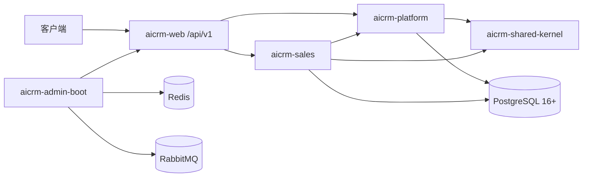

# CRM 后端

面向 B2B 销售团队的多租户 CRM 后端。当前里程碑覆盖平台权限、线索私海/公海、客户私海/公海、联系人、跟进、自动回收、线索转客户、客户合并和离职交接。

系统采用 Java 17、Spring Boot 3.2、PostgreSQL 16+ 和 DDD 模块化单体，只提供版本化 `/api/v1`。旧 `/api/*` 接口、旧 DTO、旧 Mapper、旧横向模块和旧表均不提供兼容能力。

## 当前范围

| 能力 | 状态 |
|---|---|
| 共享内核 | 统一错误、分页、ID、安全与 trace 上下文已完成 |
| 平台域 | 租户、组织、RBAC、数据范围、字段权限、BCrypt 登录、审计、幂等、Outbox/Inbox 已完成 |
| 销售域 | 线索/客户公私海及第一里程碑正逆向流程已完成 |
| `/api/v1` | OpenAPI、真实 HTTP、并发与 PostgreSQL 集成测试已覆盖 |
| 交易域 | CRM 内报价、合同和销售订单生命周期已完成；不接入履约、库存、财务或售后事实 |
| 销售分析 | 工作台汇总、CRM 销售目标及结果确认已完成 |

## 模块

| 模块 | 职责 |
|---|---|
| `aicrm-shared-kernel` | 共享值对象、错误、分页、ID、安全上下文 |
| `aicrm-platform` | 身份权限、字段授权、审计、幂等和可靠消息应用能力 |
| `aicrm-sales` | 线索、客户、联系人、跟进、归属与公海领域 |
| `aicrm-catalog` | 产品分类、产品、价目表与报价价格快照 |
| `aicrm-trade` | 报价、合同与销售订单生命周期 |
| `aicrm-analytics` | CRM 工作台汇总、销售目标与已确认结果 |
| `aicrm-web` | `/api/v1` DTO、Controller、脱敏和异常映射 |
| `aicrm-admin-boot` | 应用装配、JWT/RabbitMQ 适配器、Flyway 和运行配置 |
| `aicrm-coverage` | 仅构建期使用的全工程 JaCoCo 覆盖率聚合报告 |



## 数据库

PostgreSQL 16+ 是唯一支持的数据库。正式结构仅由 `java/aicrm-admin-boot/src/main/resources/db/migration` 中的 Flyway V1-V9 创建，禁止业务代码建表和手工改表。

V9 完成单轨切换：增加 `crm_user.password_hash`，并删除检测到的旧表。V2 不再导入旧租户或用户。由于历史迁移定义已切换，使用旧迁移创建的开发数据库必须清库重建；旧表数据不会迁移，请先在外部完成必要归档。

## 环境与构建

- JDK 17+
- Maven 3.8+
- PostgreSQL 16+
- Redis 6+
- RabbitMQ 3.x
- Docker Desktop，用于 Testcontainers 阶段门

从仓库根目录执行：

```bash
docker compose up -d postgres
mvn -f java/pom.xml clean verify
mvn -f java/pom.xml verify "-Daicrm.rabbitmq.integration.enabled=true"
mvn -f java/pom.xml -DskipTests package
java -jar java/aicrm-admin-boot/target/aicrm.jar
```

构建产物为 `java/aicrm-admin-boot/target/aicrm.jar`。`clean verify` 覆盖数据库和应用集成测试；发布前还必须以 `aicrm.rabbitmq.integration.enabled=true` 运行 RabbitMQ Testcontainers 验收。Docker 未启动、测试被跳过或任一测试失败都不算通过。

每次根工程 `verify` 在 `java/aicrm-coverage/target/site/jacoco-aggregate/index.html` 生成全工程覆盖率报告，并强制检查全工程不低于 70%、销售域不低于 80%。当前基线为 84.93% 指令覆盖率；销售域为 80.69%。

百万级性能发布门使用 [tools/performance/README.md](tools/performance/README.md) 中的 k6 API 基准执行。它必须在独立的 4C8G、10 租户、百万级销售数据预发布环境实跑，不能以本地单测或数据库直连脚本替代。

## 登录与接口

数据库不会创建可登录的默认管理员。初始化流程必须创建租户、部门、用户、角色，并在 `crm_user.password_hash` 保存 BCrypt 哈希。系统任务用户的密码字段为 NULL，不能登录。

```bash
curl -X POST http://localhost:8080/api/v1/auth/login \
  -H "Content-Type: application/json" \
  -d '{"tenantId":1,"username":"admin","password":"your-password"}'
```

登录后的请求使用 `Authorization: Bearer <token>`。JWT 仅保存租户和用户身份，角色、功能权限、字段权限与组织数据范围每次从服务端平台表解析，不能信任客户端声明。

前端初始化调用 `GET /api/v1/auth/me` 获取当前用户、角色、权限和数据范围；表单选择器使用 `GET /api/v1/directory/users`、`GET /api/v1/directory/departments` 与 `GET /api/v1/directory/public-pools?resourceType=LEAD|CUSTOMER`。报价、合同和订单均提供 `GET /api/v1/quotes|contracts|orders?page=1&size=20`。所有请求与响应中的业务 ID 都是十进制字符串，避免浏览器 Number 丢失精度。

开发环境接口文档：

- Swagger UI：<http://localhost:8080/swagger-ui.html>
- V1 OpenAPI：<http://localhost:8080/v3/api-docs/crm-v1>

## 关键配置

公共配置位于 `java/aicrm-admin-boot/src/main/resources/application.yml`。生产环境至少设置 `AICRM_JWT_SECRET`、`DB_URL`、`DB_USERNAME`、`DB_PASSWORD`、Redis、RabbitMQ 连接变量和 `AICRM_CORS_ALLOWED_ORIGINS`。JWT 密钥至少 32 字节；后者是逗号分隔的前端 Origin 白名单。

设计与验收基线位于 `docs/architecture/`。数据库字段以 Flyway 为物理事实源，API 以 OpenAPI 和契约测试为事实源。
