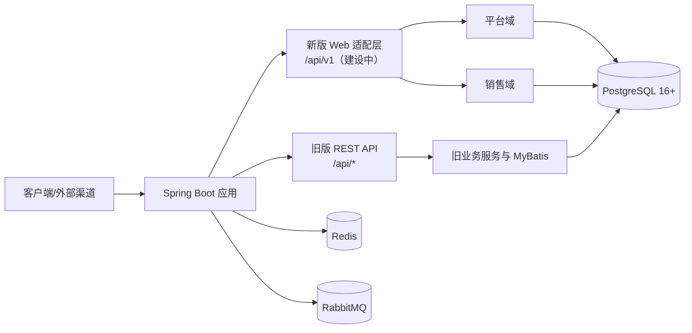

# AiCRM

面向 B2B 销售团队的客户关系管理后端。项目以“渠道获客 → 线索 → 客户与联系人 → 跟进 → 商机与交易协同”为业务主线，采用 PostgreSQL 驱动的模块化单体架构，支持多租户、权限、审计、幂等和线索/客户公海管理。

> 当前版本处于 DDD 模块化重构的第一阶段。仓库交付的是 Java 后端与领域基础代码，不包含 Web 管理端，也不包含独立的 Python/LLM 服务。

## 当前状态

| 能力 | 状态 | 说明 |
| --- | --- | --- |
| 工程底座 | 已完成 | Maven 多模块、统一错误/分页/安全上下文、JWT、审计、幂等、Outbox 基础能力 |
| 平台域 | 基础完成 | 租户、用户、角色、权限相关旧接口；新领域服务持续补齐 |
| 销售域 | 基础完成 | 线索、客户、联系人、跟进、私海/公海、认领、转移、合并、线索转客户 |
| 旧版 REST API | 可用 | 位于 `aicrm-api`，路径以 `/api/*` 开头 |
| 新版 `/api/v1` API | 开发中 | 领域应用服务已搭建，HTTP Controller 按阶段增加 |
| 渠道、会话、产品、统计等旧模块 | 可用/维护中 | 代码位于 `aicrm-service` 与 `aicrm-api`，逐步迁移到领域模块 |
| Web 管理端 | 未提供 | 请基于 OpenAPI 或自行开发前端 |
| AI 服务 | 未提供 | 当前不包含 Python 服务或模型推理代码 |

## 业务能力

- 多租户数据隔离：租户上下文、JWT 身份、权限校验和租户维度索引。
- 线索管理：来源、意向、状态、负责人、公海、分配、认领、释放、转移、回收和转化。
- 客户管理：客户、联系人、客户归属、公海、合并和跟进记录。
- 销售协同：客户/线索跟进计划、归属历史、离职交接和版本号并发控制。
- 旧业务模块：渠道账号与事件、会话消息、产品与竞品、话术、文件、任务、字典、配置、日志和看板接口。
- 工程能力：Spring Boot、MyBatis-Plus、JdbcTemplate、Flyway、Redis/Redisson、RabbitMQ、Quartz、OpenAPI/Knife4j。

线索与客户遵循同一套归属模型：私海资源必须有负责人，公海资源可被授权用户认领；认领和状态变更通过版本号条件更新，操作写入归属历史。

## 架构概览



### 模块说明

| 模块 | 职责 |
| --- | --- |
| `aicrm-shared-kernel` | 领域错误、事件、分页、标识生成、安全上下文等共享内核 |
| `aicrm-platform` | 平台应用能力：身份、权限、审计、幂等、事务 Outbox |
| `aicrm-sales` | 销售领域模型、应用命令/查询、线索与客户仓储端口及 PostgreSQL 适配器 |
| `aicrm-web` | 新版 REST API 的 DTO、Controller 与异常映射骨架（持续建设中） |
| `aicrm-common` | 旧接口通用返回、异常、JWT、租户上下文和工具类 |
| `aicrm-dao` | 旧接口实体与 MyBatis-Plus Mapper |
| `aicrm-service` | 旧接口业务服务、渠道客户端、消息消费者、定时任务和文件存储 |
| `aicrm-api` | 旧接口 Controller、OpenAPI 与 Knife4j 配置 |
| `aicrm-admin-boot` | 应用启动类、Spring 配置、数据源、Redis、RabbitMQ、Flyway |
| `aicrm-generator` | 根据数据库表生成旧版 CRUD 代码的独立工具，不参与运行时启动 |

## 环境要求

- JDK 17 或更高版本
- Maven 3.8 或更高版本
- PostgreSQL 16 或更高版本（唯一承诺支持的数据库）
- Redis 6 或更高版本
- RabbitMQ 3.x（事件异步处理需要；仅编译或部分接口调试时可按环境决定是否启用）
- Docker Desktop（可选，用于启动 PostgreSQL）

## 快速开始

以下命令均从仓库根目录执行。

### 1. 准备 PostgreSQL、Redis 和 RabbitMQ

开发配置默认连接：

| 服务 | 地址 | 默认账号/库 |
| --- | --- | --- |
| PostgreSQL | `localhost:5432` | 数据库 `aicrm`，用户 `aicrm`，密码 `aicrm_dev_123` |
| Redis | `localhost:6379` | 无密码，数据库 0 |
| RabbitMQ | `localhost:5672` | 用户 `aicrm`，密码 `aicrm_dev_123`，虚拟主机 `aicrm` |

可以使用仓库中的 Compose 文件启动 PostgreSQL：

```bash
docker compose up -d postgres
```

当前 `docker-compose.yml` 只编排 PostgreSQL；Redis 和 RabbitMQ 需要自行安装或通过其他编排文件启动。注意，Compose 文件中的 `init.sql` 绑定路径仍指向旧目录，若该路径不存在，首次启动可能失败；可将其改为 `./java/aicrm-admin-boot/src/main/resources/db/init.sql`，或使用已有 PostgreSQL。无论采用哪种方式，都建议按下方命令显式执行旧表脚本。

### 2. 初始化数据库

项目包含两条数据库演进线：

- `java/aicrm-admin-boot/src/main/resources/db/migration/V1__platform_and_sales_foundation.sql` 和 `V2__adopt_legacy_tenants_and_users.sql`：应用启动时由 Flyway 自动执行，创建 `crm_*` 新领域表。
- `java/aicrm-admin-boot/src/main/resources/db/init.sql`：旧版 `/api/*` 接口使用的 `tenant`、`users`、`lead`、`customer` 等表，需要在开发库中显式执行。

如果使用 Compose，建议在容器启动后手动执行旧表脚本（PowerShell）：

```powershell
Get-Content -Raw .\java\aicrm-admin-boot\src\main\resources\db\init.sql |
  docker exec -i aicrm-postgres psql -U aicrm -d aicrm
```

Linux/macOS 可使用：

```bash
docker exec -i aicrm-postgres psql -U aicrm -d aicrm < java/aicrm-admin-boot/src/main/resources/db/init.sql
```

也可以连接到已有数据库后直接执行同一脚本。脚本包含 `IF NOT EXISTS` 和必要的兼容性处理，重复执行前仍应先确认目标环境。

### 3. 编译与测试

```bash
cd java
mvn test
mvn -DskipTests package
```

只构建可运行包时，跳过测试即可。构建产物为：

```text
java/aicrm-admin-boot/target/aicrm.jar
```

### 4. 启动服务

```bash
cd java
java -jar aicrm-admin-boot/target/aicrm.jar
```

默认端口为 `8080`，默认激活 `dev` profile。也可以显式指定环境：

```bash
java -jar aicrm-admin-boot/target/aicrm.jar --spring.profiles.active=prod
```

## 首次登录与租户初始化

旧版登录接口为 `POST /api/auth/login`，请求体需要 `tenantId`、`mobile` 和 `password`。数据库脚本不会创建默认租户或默认账号，当前也没有匿名 bootstrap 接口，因此首次使用时需要：

1. 通过平台初始化流程创建租户；或
2. 在开发数据库中手动创建一条租户和管理员用户记录，并使用 BCrypt 密码哈希；或
3. 使用已经存在的开发数据。

通过 `TenantService` 创建租户时，会自动初始化管理员账号以及 `admin`、`sales`、`supervisor` 三个角色。未传管理员密码时，代码默认使用 `Aicrm@123456`，首次登录后请立即修改。生产环境不要使用默认密码。

登录示例：

```bash
curl -X POST http://localhost:8080/api/auth/login \
  -H "Content-Type: application/json" \
  -d '{"tenantId":1,"mobile":"13800138000","password":"your-password"}'
```

登录返回 JWT。访问受保护的 `/api/*` 接口时，在请求头中携带：

```text
Authorization: Bearer <token>
```

开发环境也支持通过 `X-Tenant-Id` 请求头或 `tenantId` 查询参数传递租户标识；生产环境应由认证网关/JWT 注入并严格校验，不能依赖客户端自行提交。

## 接口文档

开发环境默认开启：

| 地址 | 用途 |
| --- | --- |
| <http://localhost:8080/doc.html> | Knife4j 增强 UI |
| <http://localhost:8080/swagger-ui.html> | 原生 Swagger UI |
| <http://localhost:8080/v3/api-docs> | OpenAPI 3.0 JSON |

生产配置 `application-prod.yml` 会关闭上述文档入口。可通过环境变量 `AICRM_DOC_ENABLED=false` 在非生产环境关闭文档。

## 配置说明

公共配置位于 `java/aicrm-admin-boot/src/main/resources/application.yml`，开发和生产覆盖分别位于 `application-dev.yml`、`application-prod.yml`。

生产环境至少应设置以下变量：

| 变量 | 作用 |
| --- | --- |
| `AICRM_JWT_SECRET` | JWT 签名密钥，至少 32 字节随机值 |
| `DB_URL` | PostgreSQL JDBC 地址 |
| `DB_USERNAME` / `DB_PASSWORD` | 数据库账号密码 |
| `REDIS_HOST` / `REDIS_PORT` / `REDIS_PASSWORD` | Redis 连接信息 |
| `RABBITMQ_HOST` / `RABBITMQ_PORT` | RabbitMQ 地址 |
| `RABBITMQ_USERNAME` / `RABBITMQ_PASSWORD` / `RABBITMQ_VHOST` | RabbitMQ 认证信息 |

文件存储默认使用本地目录 `./data/upload`，也支持在配置中切换到 MinIO。生产环境请使用持久化磁盘或对象存储，并收紧 CORS、上传大小和外部渠道回调校验。

## 项目结构

```text
.
├── java/
│   ├── pom.xml                 # Maven 聚合工程
│   ├── aicrm-shared-kernel/    # 领域共享内核
│   ├── aicrm-platform/         # 平台域
│   ├── aicrm-sales/            # 销售域
│   ├── aicrm-web/              # 新版 API 骨架
│   ├── aicrm-common/           # 旧版通用能力
│   ├── aicrm-dao/              # 旧版数据访问
│   ├── aicrm-service/          # 旧版业务服务
│   ├── aicrm-api/              # 旧版接口层
│   ├── aicrm-admin-boot/       # 启动模块与配置
│   └── aicrm-generator/        # 代码生成器
├── docker-compose.yml          # 本地 PostgreSQL 编排
├── 智能CRM系统整体闭环流程文档.md # 产品与业务全景设计
├── 开发阶段计划.md             # DDD 重构计划与验收标准
├── CHANGELOG.md
├── CONTRIBUTING.md
├── SECURITY.md
├── CODE_OF_CONDUCT.md
├── NOTICE
├── LICENSE
└── README.md
```

## 开发约定

- PostgreSQL 是唯一官方数据库；数据库变更使用 Flyway 迁移脚本。
- 新业务优先进入领域模块，Controller、应用服务、领域对象和持久化对象保持隔离。
- 跨领域通过公开应用接口或领域事件协作，不直接依赖其他领域的实体、Mapper 或 Repository。
- 所有业务查询和命令必须带租户上下文；涉及私海/公海的操作需要校验数据范围和资源版本。
- 密码仅保存 BCrypt 哈希，日志中不得记录密码、JWT 或完整敏感信息。

提交代码前建议执行：

```bash
cd java
mvn test
mvn -DskipTests package
```

更完整的贡献流程请阅读 [CONTRIBUTING.md](CONTRIBUTING.md)，安全问题请按照 [SECURITY.md](SECURITY.md) 的方式私下报告。

## 路线图

下一阶段重点包括：

- 完成 `/api/v1` 线索、客户、联系人和跟进 Controller 及契约测试。
- 补齐组织、数据范围、字段权限和审批能力。
- 将渠道、会话、产品、统计等旧实现迁移到领域模块。
- 增加 Testcontainers、ArchUnit、并发认领和跨租户安全测试。
- 在核心业务稳定后再建设管理端和外部系统连接器。

详细阶段划分与验收标准见 [开发阶段计划.md](开发阶段计划.md)，完整业务边界见 [智能CRM系统整体闭环流程文档.md](智能CRM系统整体闭环流程文档.md)。

## 开源协议

本项目使用 [Apache License 2.0](LICENSE)。使用渠道接口、客户数据和文件存储时，请遵守对应平台规则、隐私保护要求及适用法律法规。本项目不提供绕过平台规则或未经授权采集个人信息的能力。
