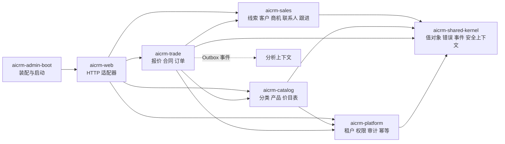

# CRM 后端架构基线

## 1. 适用范围

本目录是后端研发、测试和评审的架构基线。当前已交付工程底座、线索/客户私海公海闭环、阶段 2A 的产品与价格目录、阶段 2B 的商机管道、阶段 2C 的报价根/版本/快照行，以及阶段 2D 的审批定义与报价审批闭环。阶段 3 已交付合同草稿、签署撤回、签署、作废、合同变更台账，以及销售订单创建、确认、取消审批和 CRM 内部关闭。交付、库存、回款、开票和售后不属于 CRM 运行范围。

进入下一阶段必须同时满足：本目录相关设计已评审、Flyway 可从空库初始化、模块边界测试通过、租户与数据范围测试通过、当前阶段端到端用例通过。

## 2. 限界上下文

依赖规则：领域模块内部采用 `api/application/domain/infrastructure`；领域层只依赖共享内核；跨领域只能调用公开应用接口或订阅事件；Controller 不得访问 Repository，应用服务不得访问其他领域的实体或 Mapper。

## 3. 数据主责

| 上下文 | 主责数据 | 不负责 |
|---|---|---|
| platform | 租户、组织、用户、角色、权限、审计、幂等、Outbox | 销售业务状态 |
| sales | 公海池、线索、客户、联系人、跟进、商机、阶段历史、归属历史、交接 | 交付、库存、回款、开票、售后 |
| catalog | 产品分类、产品、价目表、价格项 | 合同成交价审批与报价折扣 |
| trade | 报价、报价版本、报价快照行、销售合同、签署状态和销售订单 | 交付、库存、回款、开票、售后事实 |

## 4. 阶段门

| 门禁 | 必须产物 | 通过标准 |
|---|---|---|
| G0 设计基线 | 本目录全部文档 | 对象、状态、权限、接口、事件命名一致 |
| G1 工程底座 | 模块、Flyway、鉴权、审计、幂等、Outbox | 空库启动和隔离测试通过 |
| G2 销售主数据 | 私海/公海、转换、合并、交接 | 正向与逆向闭环测试通过 |
| G3 后续阶段准入 | 下一领域详细设计 | G0-G2 无阻塞缺陷，ADR 已批准 |

## 5. 文档索引

- [数据字典](data-dictionary.md)
- [数据库命名、主键与迁移规范](database-conventions.md)
- [租户、组织、数据范围与字段权限](authorization.md)
- [状态机](state-machines.md)
- [API 与事件契约](api-events.md)
- [错误码](error-codes.md)
- [审计、幂等与 Outbox](reliability.md)
- [模块依赖与 ArchUnit](module-boundaries.md)
- [后续交易域边界](future-contexts.md)
- [第一里程碑阶段门](stage-gate.md)
- [安全与非功能要求](security-nfr.md)
- [架构决策记录](adr.md)
- [阶段 2A 产品与价格设计](catalog.md)
- [阶段 2B 商机设计](opportunity.md)
- [阶段 2C 报价设计](quote.md)
- [阶段 2D 审批设计](approval.md)
- [阶段 3 合同与销售订单设计](contract-order.md)
