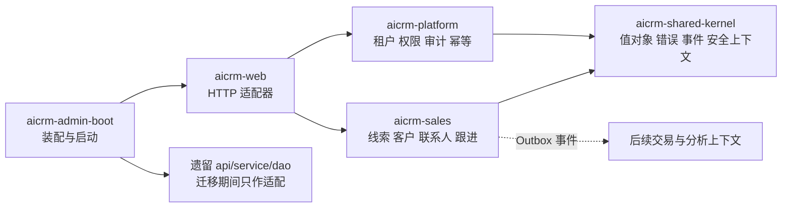

# CRM 后端架构基线

## 1. 适用范围

本目录是后端研发、测试和评审的阶段 0 基线。当前只准实现工程底座以及线索、客户私海/公海闭环；商机、报价、合同、订单、交付、财务和售后只定义上下文边界，不进入编码。

进入下一阶段必须同时满足：本目录相关设计已评审、Flyway 可从空库初始化、模块边界测试通过、租户与数据范围测试通过、当前阶段端到端用例通过。

## 2. 限界上下文

依赖规则：领域模块内部采用 `api/application/domain/infrastructure`；领域层只依赖共享内核；跨领域只能调用公开应用接口或订阅事件；Controller 不得访问 Repository，应用服务不得访问其他领域的实体或 Mapper。

## 3. 数据主责

| 上下文 | 主责数据 | 不负责 |
|---|---|---|
| platform | 租户、组织、用户、角色、权限、审计、幂等、Outbox | 销售业务状态 |
| sales | 公海池、线索、客户、联系人、跟进、归属历史、交接 | 库存、到账、正式发票 |
| catalog（后续） | 产品、价格表、折扣规则 | 合同成交价审批 |
| trade（后续） | 合同、合同变更、销售订单 | 实际库存与发货 |
| fulfillment（后续） | 交付计划、验收、异常协调 | ERP 库存事实 |
| finance（后续） | 回款计划、开票申请及外部结果镜像 | 到账核销与正式发票主数据 |
| aftersales（后续） | 工单、退货、退款协调 | 财务退款事实 |

## 4. 阶段门

| 门禁 | 必须产物 | 通过标准 |
|---|---|---|
| G0 设计基线 | 本目录全部文档 | 对象、状态、权限、接口、事件命名一致 |
| G1 工程底座 | 模块、Flyway、鉴权、审计、幂等、Outbox | 空库启动和隔离测试通过 |
| G2 销售主数据 | 私海/公海、转换、合并、交接 | 正向与逆向闭环测试通过 |
| G3 后续阶段准入 | 下一领域详细设计 | G0-G2 无阻塞缺陷，ADR 已批准 |

## 5. 文档索引

- [数据字典](data-dictionary.md)
- [状态机](state-machines.md)
- [API 与事件契约](api-events.md)
- [安全与非功能要求](security-nfr.md)
- [架构决策记录](adr.md)
