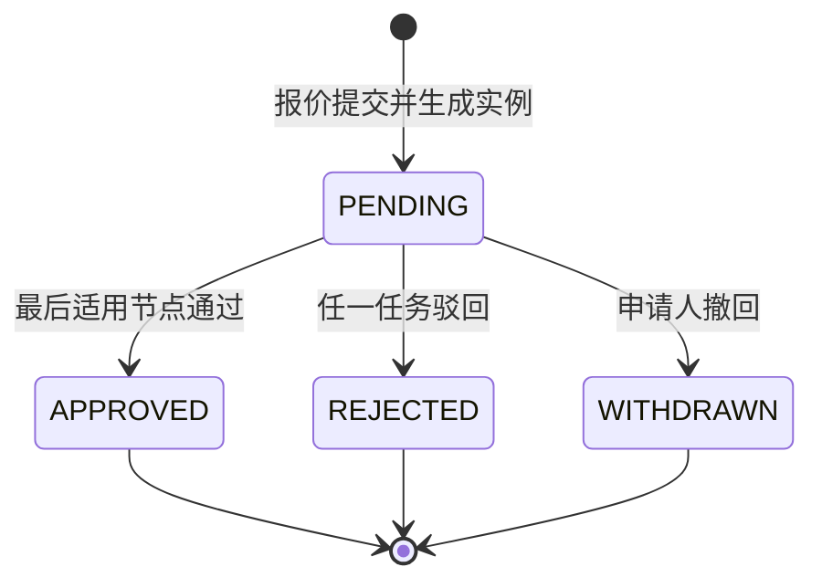

# 阶段 2D：审批设计

状态：已进入实现；物理基线：Flyway `V13__approval_foundation.sql`。本阶段交付可复用的顺序审批定义、实例、任务和不可变动作记录，当前报价是首个接入资源。

## 1. 模型与数据主责

| 对象 | 表 | 状态 | 规则 |
|---|---|---|---|
| 审批定义 | `crm_approval_definition` | `DRAFT`、`ACTIVE`、`RETIRED`、`DISABLED` | 同一租户、资源类型和编码的定义版本递增；同一时刻仅一个启用版本。 |
| 定义节点 | `crm_approval_definition_node` | 无独立状态 | 节点按 `node_no` 顺序执行；每节点支持 `ANY` 或 `ALL`，审批人为同租户启用用户。 |
| 审批实例 | `crm_approval_instance` | `PENDING`、`APPROVED`、`REJECTED`、`WITHDRAWN` | 提交时固化完整定义与业务快照；同一资源只允许一个未结束实例。 |
| 审批任务 | `crm_approval_task` | `PENDING`、`APPROVED`、`REJECTED`、`TRANSFERRED`、`CANCELLED` | 仅任务指派人能处理；转交会终止原任务并创建替代任务。 |
| 审批动作 | `crm_approval_action` | `START`、`ACTIVATE_NODE`、`APPROVE`、`REJECT`、`WITHDRAW`、`TRANSFER` | 只允许插入，保存操作人、前后快照和操作号。 |

定义节点可选配置确定性数字条件，例如 `{"field":"totalAmount","operator":"GTE","value":10000}`。支持 `ALWAYS`、`GT`、`GTE`、`LT`、`LTE`、`EQ`；不满足条件的节点跳过。条件只读取提交时业务快照，后续主数据变化不得改变在途审批路径。

## 2. 状态与报价衔接

报价提交先将报价根和当前版本更新为 `SUBMITTED`，然后在同一事务创建审批实例、首个适用节点任务、审计和 Outbox。最后节点通过时报价同步为 `APPROVED`；任务驳回时同步为 `REJECTED` 并保留驳回意见；申请人撤回时实例为 `WITHDRAWN`，报价恢复为 `DRAFT`。报价不存在独立驳回入口，防止绕过任务授权。审批中的报价不可直接过期，必须先撤回审批。

## 3. API、权限与可靠性

| API | 权限 | 规则 |
|---|---|---|
| `POST /api/v1/approval-definitions` | `approval:manage` | 创建草稿定义；节点顺序、审批人、条件在创建时校验。 |
| `POST /api/v1/approval-definitions/{id}/actions/activate` | `approval:manage` | 需要定义版本；同编码旧启用定义转为 `RETIRED`。 |
| `GET /api/v1/approval-tasks/pending` | `approval:task:read` | 仅返回当前用户、当前租户的待办。 |
| `POST /api/v1/approval-tasks/{id}/actions/approve|reject|transfer` | `approval:task:act` | 任务版本必填；驳回意见必填；转交对象必须为同租户启用用户。 |
| `POST /api/v1/quotes/{id}/actions/withdraw-approval` | `quote:withdraw` | 申请人或审批管理员撤回自己的在途报价审批，需审批实例版本。 |

报价创建和提交必须提供 `Idempotency-Key`。定义、实例、任务、动作、报价变更、审计和 Outbox 均在本地事务内完成；实例运行不依赖 RabbitMQ。每个审批动作与业务结论均有独立短操作号，满足 `VARCHAR(64)` 的统一约束并支持审计与 Outbox 关联。

## 4. 当前边界

首期只支持固定顺序节点、指定用户审批人与单字段数字条件。按角色、部门、金额区间以外的复杂表达式、加签、抄送、委托和定时催办将在独立阶段门中建模；不得把脚本或动态表达式直接存入条件字段执行。
