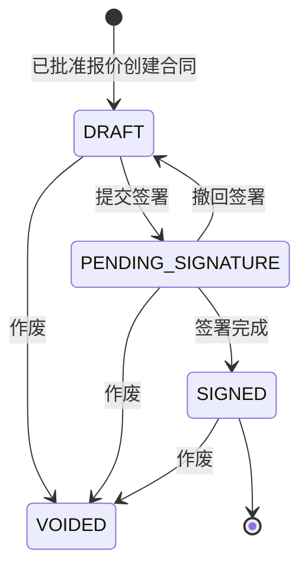
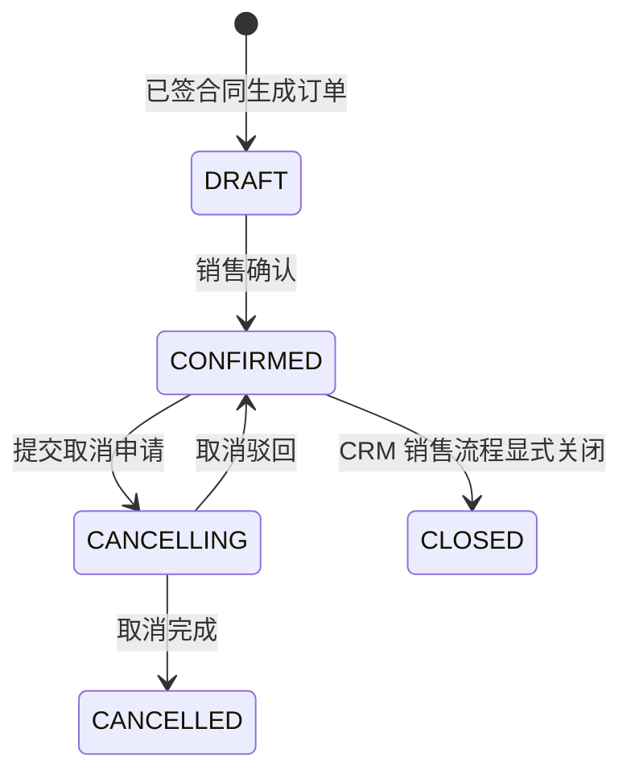

# 阶段 3：合同与销售订单设计

状态：设计基线；物理基线：Flyway `V14__contract_and_order_foundation.sql`。本阶段由交易域主责销售合同、合同变更、销售订单和取消申请；交付、库存、回款、开票和售后不属于 CRM 交易域。

## 1. 范围与主责

| 对象 | CRM 主责 | ERP/财务主责 | 本阶段边界 |
|---|---|---|---|
| 销售合同 | 草稿、提交签署、签署结果、变更和作废 | 归档副本可同步，不反向覆盖 CRM 合同事实 | 仅已批准报价可创建合同。 |
| 销售订单 | 从已签合同生成、确认、取消申请、取消结果与 CRM 内部关闭 | 库存、实际发货、回款、开票和售后状态 | CRM 只维护销售商业事实，不依赖外部结果关闭订单。 |
| 合同/订单明细 | 固化报价或合同中的商业快照 | 物料、库存和履约事实 | 不随产品目录变化回写。 |

## 2. 聚合、状态与逆向流程

- 合同创建仅引用同租户、状态为 `APPROVED` 的报价及其当前批准版本，合同明细复制报价行快照。
- 合同变更不是直接改写已签合同；变更申请只允许拟变更合同名称和有效期，保存原始快照、拟变更快照、原因和审批状态。批准仅形成不可变管理台账，不生成修订合同，也不覆盖原签署快照或订单快照。
- 合同作废须记录原因和时间。已经存在未取消销售订单的签署合同不得直接作废，必须先完成订单取消。
- 订单创建仅引用已签且未作废合同；确认后只允许走取消申请，不允许删除或直接回到草稿。
- ERP、财务和客服系统不接入 CRM 交易流程；历史兼容字段不构成接口、事件或状态迁移依据。

## 3. 数据模型

| 表 | 用途 | 关键约束 |
|---|---|---|
| `crm_contract` | 合同根与当前商业事实 | 活跃合同号租户内唯一；状态为 `DRAFT/PENDING_SIGNATURE/SIGNED/VOIDED`；金额非负、币种三位大写。 |
| `crm_contract_line` | 合同不可变商业快照行 | 每合同号行号唯一；数量正数；金额、折扣、税率受范围检查。 |
| `crm_contract_change` | 合同变更申请与快照 | 每合同变更号唯一；状态为 `DRAFT/SUBMITTED/APPROVED/REJECTED/CANCELLED`；原始与变更快照为 JSONB。 |
| `crm_sales_order` | CRM 销售订单事实 | 活跃订单号租户内唯一；状态为 `DRAFT/CONFIRMED/CANCELLING/CANCELLED/CLOSED`；仅 `CLOSED` 订单保存关闭时间和关闭原因。 |
| `crm_sales_order_line` | 订单商业快照行 | 每订单行号唯一；引用仅保存 ID 和快照，不建立跨上下文实体外键。 |
| `crm_order_cancel` | 取消申请与处理结果 | 每订单取消编号唯一；状态为 `PENDING/APPROVED/REJECTED/COMPLETED`；原订单保持不可变。 |

所有表使用应用生成的 `BIGINT` 主键、`tenant_id` 共享表隔离、UTC `TIMESTAMPTZ`、`NUMERIC(18,2)` 金额、乐观锁 `version` 和软删除审计字段。合同到报价、订单到合同以及合同/订单到客户均只保存 ID，由应用服务做租户和业务状态校验；不建立跨聚合实体外键。

## 4. API 契约与权限

| API | 权限 | 幂等与版本规则 |
|---|---|---|
| `POST /api/v1/contracts` | `contract:create` | `Idempotency-Key`；报价必须已批准。 |
| `GET /api/v1/contracts/{id}` | `contract:read:own/any` | 使用来源商机的数据范围。 |
| `POST /api/v1/contracts/{id}/actions/submit-signature|withdraw-signature|sign|void` | 对应 `contract:*` | 请求含合同 `version`；作废额外含原因。 |
| `POST /api/v1/contracts/{id}/changes` 及变更的 `submit|cancel|approve|reject` 动作 | `contract:change` / `contract:approve-change` | 创建带 `Idempotency-Key`；状态动作带变更 `version`。 |
| `POST /api/v1/orders` | `order:create` | `Idempotency-Key`；合同必须已签。 |
| `POST /api/v1/orders/{id}/actions/confirm|request-cancel|close` 及取消申请的 `approve|reject` 动作 | 对应 `order:*` | 申请带 `Idempotency-Key`；状态动作带订单和取消申请 `version`；关闭原因必填。 |

阶段 3 已完成“批准报价 -> 合同 -> 销售订单”闭环；不建设交付、回款、开票或售后表。

## 5. 事件与验收

事件：`ContractCreated`、`ContractSignatureSubmitted`、`ContractSignatureWithdrawn`、`ContractSigned`、`ContractVoided`、`ContractChangeCreated/Submitted/Cancelled/Approved/Rejected`、`OrderCreated`、`OrderConfirmed`、`OrderCancellationRequested/Rejected`、`OrderCancelled`、`OrderClosed`。

阶段门必须验证：跨租户引用拒绝；未批准报价不可创建合同；未签合同不可创建订单；签署、作废、订单确认、取消和关闭均有乐观锁冲突测试；重复创建不产生重复聚合、审计或 Outbox；产品、价格和报价变更不会回写合同/订单快照。
