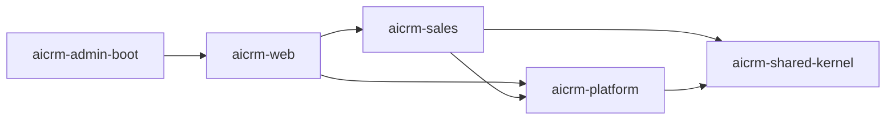

# 模块依赖与 ArchUnit 规则

## 允许依赖

- `domain` 只能依赖自身领域包、JDK 和 shared-kernel；不得依赖 Spring、JDBC、Controller、Mapper 或其他领域实体。
- Controller 只能调用公开 application service，不得引用 Mapper、JdbcTemplate 或 infrastructure。
- application 负责事务编排，可调用本上下文 repository port 和平台公开服务；不得调用其他上下文实体/Mapper。
- infrastructure 实现本上下文 port；每条租户 SQL 必须显式带 `tenant_id`。
- 后续上下文只通过公开应用接口、只读投影或版本化领域事件交互；不得新增 Maven 循环依赖。

`ModuleDependencyTest` 自动检查领域纯净性和 Controller 不访问持久层。新增模块时必须扩充规则，CI 的 `mvn verify` 是合并门禁。聚合构建只允许 `shared-kernel/platform/sales/web/admin-boot` 五个模块；不得重新引入横向 `common/dao/service/api` 模块、Mapper 实体或兼容 Controller。
