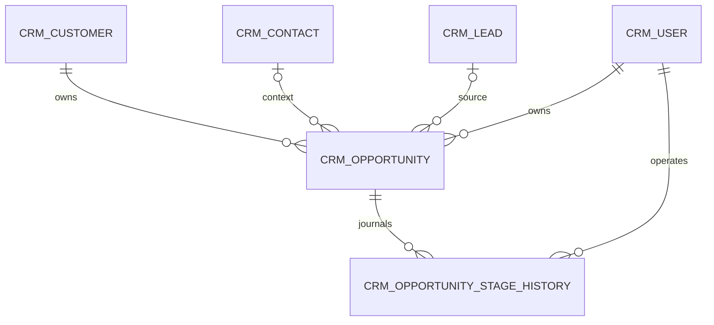

# 阶段 2B 商机设计

版本：`M2B-1.0`；实现基线：Flyway `V11`。本阶段只交付商机管道，不创建报价、合同或订单表。

## 业务边界

- 商机是销售团队针对一个有效客户发起的销售机会。客户为必填主数据；联系人和来源线索为可选上下文。
- 创建人即负责人，负责人部门由数据库按用户当前部门固定为操作时快照。商机不参与线索/客户公海规则。
- 阶段和终态由确定性命令推进：创建、阶段推进、赢单、输单、重启。报价只能在后续报价阶段通过商机 ID 关联，不在本阶段预建报价字段。

## 模型与不变量

`crm_opportunity` 的 `customer_id` 必须引用同租户有效、未合并客户。填写 `contact_id` 时联系人必须属于该客户；填写 `source_lead_id` 时来源线索须同租户，且若已转换，必须关联当前客户。金额不可为负、币种为三位大写 ISO 代码、概率在 0 到 100 之间。

## 接口与权限

| 命令 | 路径 | 权限 | 幂等 / 并发 |
|---|---|---|---|
| 创建 | `POST /api/v1/opportunities` | `opportunity:create` | 必须 `Idempotency-Key` |
| 查询 | `GET /api/v1/opportunities`、`/{id}` | `opportunity:read:own/any` + 数据范围 | 无写入 |
| 推进阶段 | `POST /{id}/actions/stage` | `opportunity:stage` + 写权限 | 请求 `version` |
| 赢单 | `POST /{id}/actions/win` | `opportunity:win` + 写权限 | 请求 `version` |
| 输单 | `POST /{id}/actions/lose` | `opportunity:lose` + 写权限 | 请求 `version`，原因必填 |
| 重启 | `POST /{id}/actions/restart` | `opportunity:restart` + 写权限 | 请求 `version`，仅输单可执行 |

列表和详情均按负责人、部门及角色数据范围过滤。管理员具备全部范围；拥有 `*:any` 也不能绕过所属角色的部门范围。

## 事务事实

每个命令使用单个 PostgreSQL 事务完成聚合写入、阶段历史、审计和 Outbox。V11 延迟约束触发器在提交时验证历史和审计，`OpportunityCommandService` 在同一事务追加 `OpportunityCreated`、`OpportunityStageChanged`、`OpportunityWon`、`OpportunityLost` 或 `OpportunityRestarted`。消费者必须继续以 Inbox 或业务键去重。

## 验收

`SalesApiV1IntegrationTest.managesOpportunityStagesLossRestartAndWinWithImmutableHistory` 覆盖从客户创建商机、阶段推进、输单、重启、赢单，以及五条阶段历史、五条审计和五条 Outbox 事件。`DatabaseStageGateTest` 从空 PostgreSQL 16 数据库执行 V1 至 V11。
