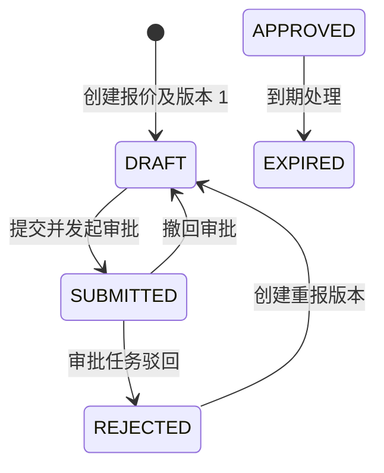

# 阶段 2C：报价设计

状态：已完成基础实现；物理基线：Flyway `V12__quote_foundation.sql`，审批衔接见 [阶段 2D 审批设计](approval.md)。本阶段交付报价根、报价版本和不可变快照行，不创建合同或订单。

## 1. 聚合与规则

| 对象 | 表 | 状态 | 规则 |
|---|---|---|---|
| 报价根 | `crm_quote` | `DRAFT`、`SUBMITTED`、`APPROVED`、`REJECTED`、`EXPIRED`、`CANCELLED` | 引用同租户商机、客户和价目表；根状态是对外业务状态。 |
| 报价版本 | `crm_quote_version` | `DRAFT`、`SUBMITTED`、`APPROVED`、`REJECTED`、`EXPIRED` | 每个报价内版本号唯一；批准、拒绝、过期版本不可再更新或删除。 |
| 报价行 | `crm_quote_line` | 不单独流转 | 创建时固化产品编号、SKU、名称、单位、目录价、最低价、成交价、税率和折扣；永不回写目录主数据。 |

创建报价必须使用生效价目表，商机必须为进行中或赢单，产品与价目项必须可销售。成交价不得高于目录价，也不得低于已配置的最低价；报价行数量为 1 至 100。

## 2. 并发与状态

提交和过期请求必须同时携带 `rootVersion` 与 `version`。前者只校验 `crm_quote.version`，后者只校验当前 `crm_quote_version.version`；任一条件更新失败即返回 `409 CONFLICT`，整个事务回滚。提交还必须给出启用审批定义和 `Idempotency-Key`；审批中的报价须先撤回审批才能回到草稿或执行其他后续动作。

## 3. API 与可靠性

| API | 权限 | 规则 |
|---|---|---|
| `POST /api/v1/quotes` | `quote:create` | 须带 `Idempotency-Key`；创建根、版本、行、审计和 Outbox 为同一事务。 |
| `GET /api/v1/quotes/{id}` | `quote:read:own/any` | 复用所属商机的数据范围校验。 |
| `GET /api/v1/quotes/{id}/versions` | `quote:read:own/any` | 版本按版本号倒序。 |
| `GET /api/v1/quotes/{id}/versions/{versionNo}/lines` | `quote:read:own/any` | 返回指定版本的快照行。 |
| `POST /api/v1/quotes/{id}/actions/submit` | `quote:submit` | 请求包含 `rootVersion`、`version`、`approvalDefinitionCode` 和 `Idempotency-Key`。 |
| `POST /api/v1/quotes/{id}/actions/withdraw-approval` | `quote:withdraw` | 请求包含审批实例 ID 与审批实例版本；仅申请人或审批管理员可撤回。 |
| `POST /api/v1/quotes/{id}/actions/expire` | `quote:expire` | 仅已批准且确已到期的报价；请求包含根和当前版本乐观锁。 |
| `POST /api/v1/quotes/{id}/versions` | `quote:write:own/any` | 仅当前报价为 `REJECTED`；请求包含 `expectedQuoteVersion`、新快照行和 `Idempotency-Key`。 |

每次状态变化写一条审计和一条 Outbox 事件：`QuoteCreated`、`QuoteSubmitted`、`QuoteApproved`、`QuoteRejected`、`QuoteApprovalWithdrawn`、`QuoteExpired`。所有按事件验证或运营查询都必须以 `tenant_id + aggregate_type + aggregate_id` 定位单个聚合；租户范围的数量仅用于明确的统计报表，不用于业务状态判断。

重报不会修改被拒绝版本或其行。它使用报价根的 `expectedQuoteVersion` 做条件更新，创建 `current_version_no + 1` 的草稿版本，按当前生效价目表重新校验并固化新行快照，同时将根切换为 `DRAFT`。根切换、版本与行插入、审计、Outbox 和幂等记录在同一事务内完成，任一步失败均回滚。

## 4. 测试边界

`SalesApiV1IntegrationTest.createsSubmitsAndApprovesQuoteUsingConfiguredWorkflow` 覆盖产品价格快照、审批定义创建和启用、报价创建、幂等提交、审批待办、审批通过和聚合范围的 Outbox 事件。该用例与目录测试共享 PostgreSQL 容器，但不依赖任何租户级事件总数，因此测试顺序和其他聚合的事件均不会改变它的结果。
