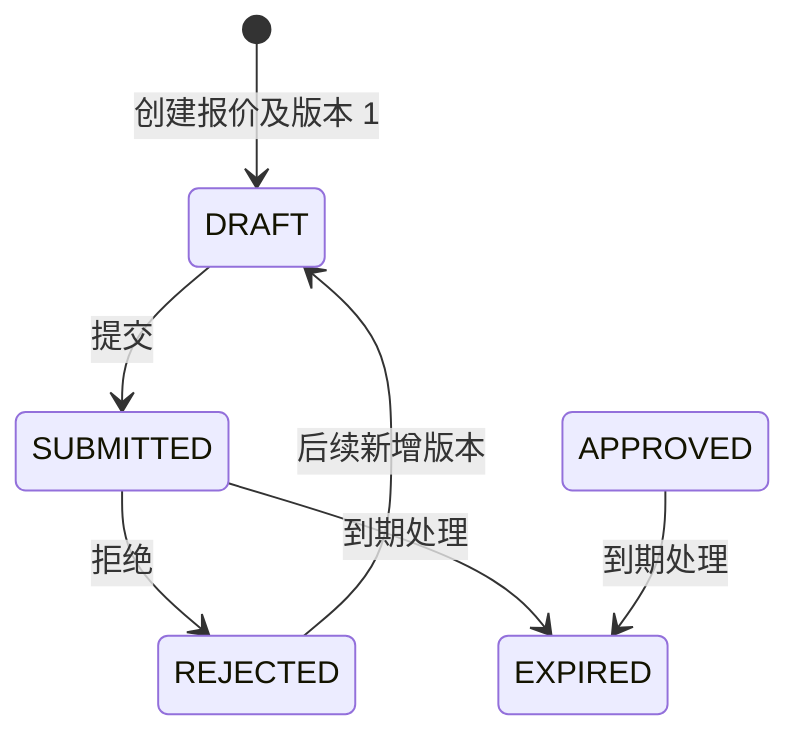

# 阶段 2C：报价设计

状态：已进入实现；物理基线：Flyway `V12__quote_foundation.sql`。本阶段只交付报价根、报价版本和不可变快照行，不创建合同、订单或审批实例。

## 1. 聚合与规则

| 对象 | 表 | 状态 | 规则 |
|---|---|---|---|
| 报价根 | `crm_quote` | `DRAFT`、`SUBMITTED`、`APPROVED`、`REJECTED`、`EXPIRED`、`CANCELLED` | 引用同租户商机、客户和价目表；根状态是对外业务状态。 |
| 报价版本 | `crm_quote_version` | `DRAFT`、`SUBMITTED`、`APPROVED`、`REJECTED`、`EXPIRED` | 每个报价内版本号唯一；批准、拒绝、过期版本不可再更新或删除。 |
| 报价行 | `crm_quote_line` | 不单独流转 | 创建时固化产品编号、SKU、名称、单位、目录价、最低价、成交价、税率和折扣；永不回写目录主数据。 |

创建报价必须使用生效价目表，商机必须为进行中或赢单，产品与价目项必须可销售。成交价不得高于目录价，也不得低于已配置的最低价；报价行数量为 1 至 100。

## 2. 并发与状态

提交、拒绝和过期请求必须同时携带 `rootVersion` 与 `version`。前者只校验 `crm_quote.version`，后者只校验当前 `crm_quote_version.version`；任一条件更新失败即返回 `409 CONFLICT`，整个事务回滚。该规则防止报价根与版本独立演进后出现丢失更新。

## 3. API 与可靠性

| API | 权限 | 规则 |
|---|---|---|
| `POST /api/v1/quotes` | `quote:create` | 须带 `Idempotency-Key`；创建根、版本、行、审计和 Outbox 为同一事务。 |
| `GET /api/v1/quotes/{id}` | `quote:read:own/any` | 复用所属商机的数据范围校验。 |
| `GET /api/v1/quotes/{id}/versions` | `quote:read:own/any` | 版本按版本号倒序。 |
| `GET /api/v1/quotes/{id}/versions/{versionNo}/lines` | `quote:read:own/any` | 返回指定版本的快照行。 |
| `POST /api/v1/quotes/{id}/actions/submit|reject|expire` | 对应 `quote:*` | 请求包含 `rootVersion` 和 `version` 两个乐观锁字段；拒绝额外要求原因。 |

每次状态变化写一条审计和一条 Outbox 事件：`QuoteCreated`、`QuoteSubmitted`、`QuoteRejected`、`QuoteExpired`。所有按事件验证或运营查询都必须以 `tenant_id + aggregate_type + aggregate_id` 定位单个聚合；租户范围的数量仅用于明确的统计报表，不用于业务状态判断。

## 4. 测试边界

`SalesApiV1IntegrationTest.createsSubmitsAndRejectsQuoteUsingPublishedPriceSnapshots` 覆盖产品价格快照、创建、提交、双乐观锁冲突、拒绝和聚合范围的 Outbox 事件。该用例与目录测试共享 PostgreSQL 容器，但不依赖任何租户级事件总数，因此测试顺序和其他聚合的事件均不会改变它的结果。
