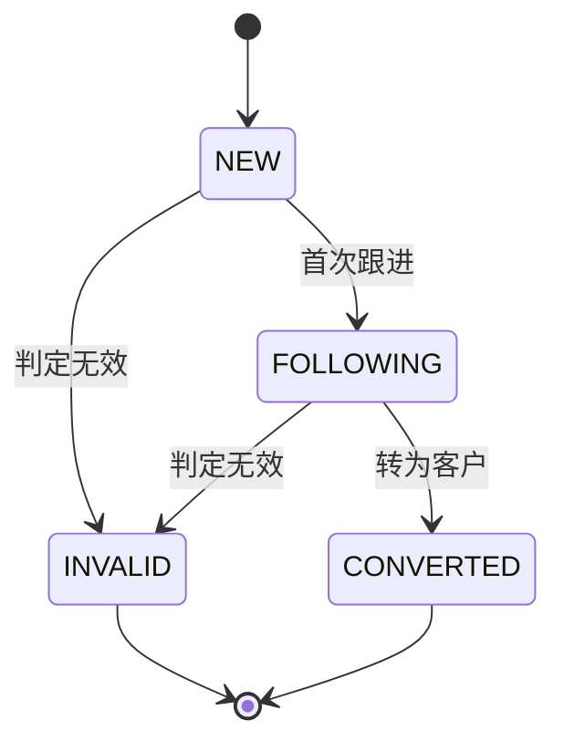
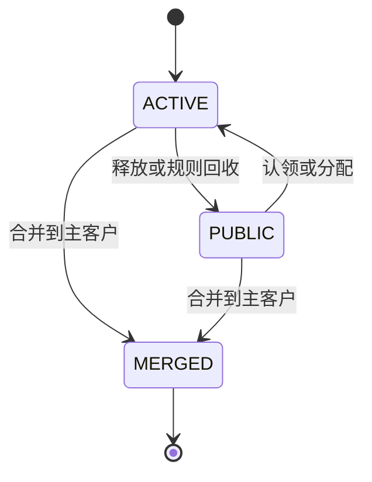

# 状态机与业务不变量

## 1. 线索状态

归属状态与业务状态正交：`PRIVATE <-> PUBLIC` 不改变 `NEW/FOLLOWING`；`INVALID` 和 `CONVERTED` 为终态，不允许认领、释放或继续跟进。转换必须保留来源、跟进历史并写入 `customer_id`。

## 2. 客户状态

数据库以软删除表示被合并客户，归属历史以 `MERGE` 记录业务语义。合并前必须验证同租户、源目标不同、目标未删除；联系人、线索引用和跟进引用迁移到主客户。

## 3. 操作前置条件

| 操作 | 前置条件 | 结果 |
|---|---|---|
| 认领 | 位于指定公海、版本一致、具备认领权限 | 转入操作者私海 |
| 释放 | 私海且操作者为负责人或有全局写权限 | 转入指定公海 |
| 分配 | 有分配权限、目标用户同租户且启用 | 转入目标用户私海 |
| 转移 | 当前为私海、版本一致 | 负责人变化 |
| 回收 | 超过公海规则期限且仍为私海 | 系统转入规则指定公海 |
| 无效 | 非终态、填写原因 | 状态变为 `INVALID` |
| 转换 | 私海有效线索、版本一致、幂等键有效 | 新建客户并关联线索 |
| 合并 | 同租户两个有效客户、版本一致、幂等键有效 | 引用迁移，源客户软删除 |
| 交接 | 原/新负责人同租户、新负责人启用 | 指定资源批量转移并逐条留痕 |
