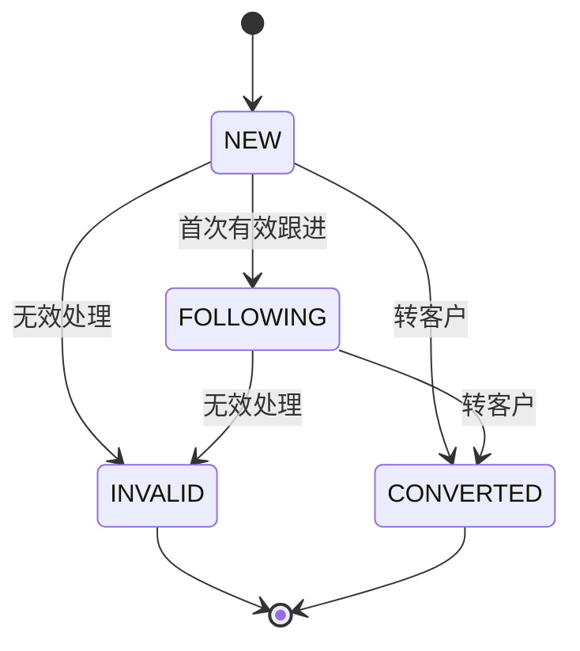
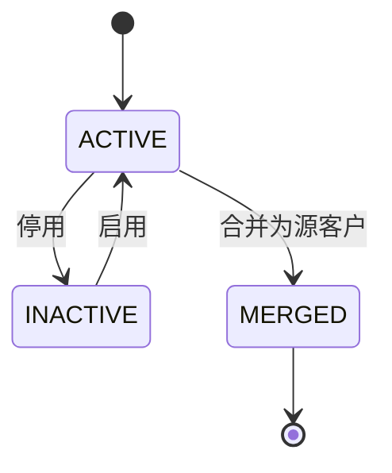
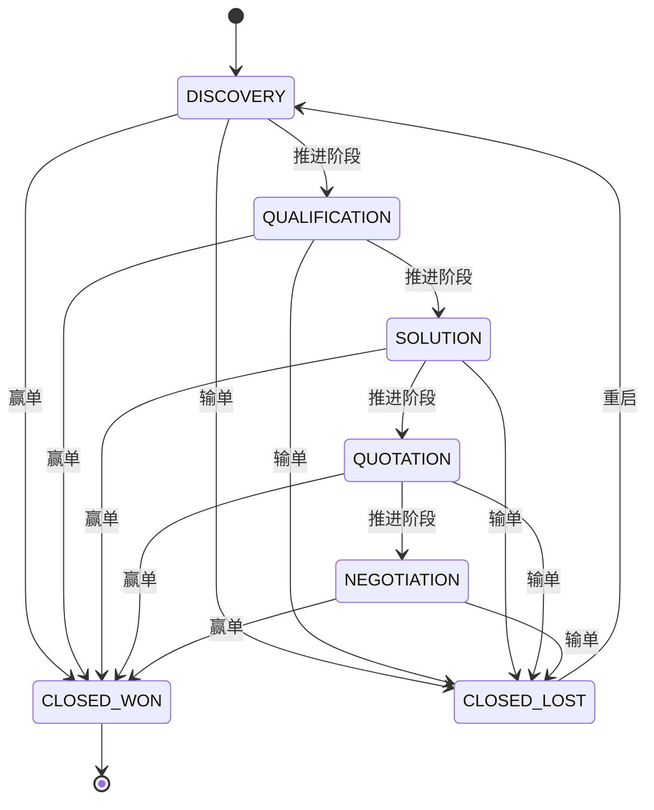
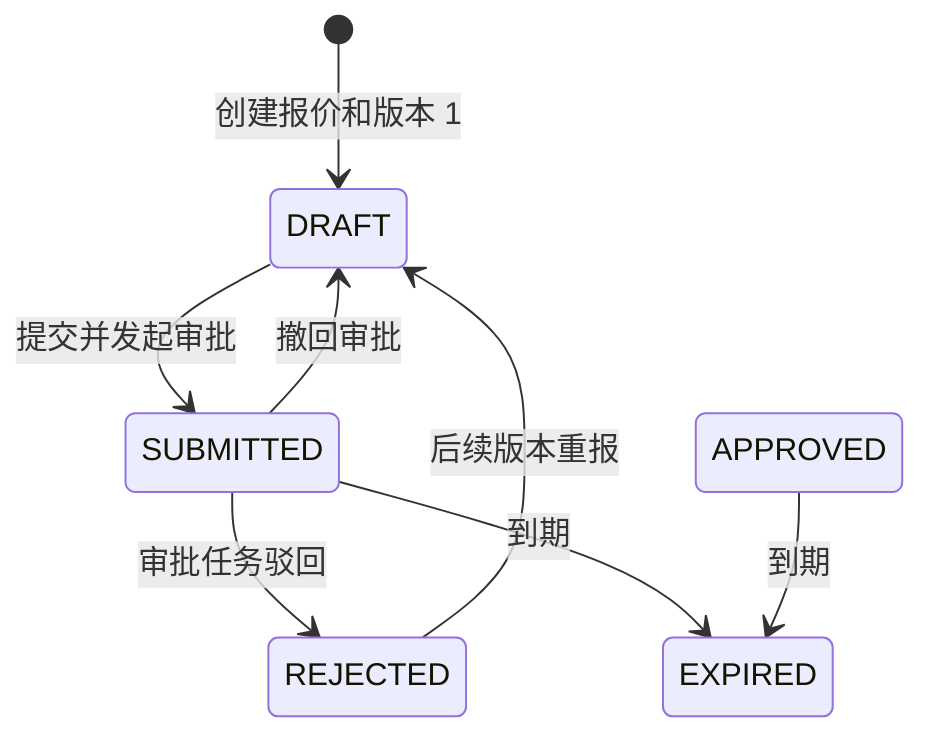
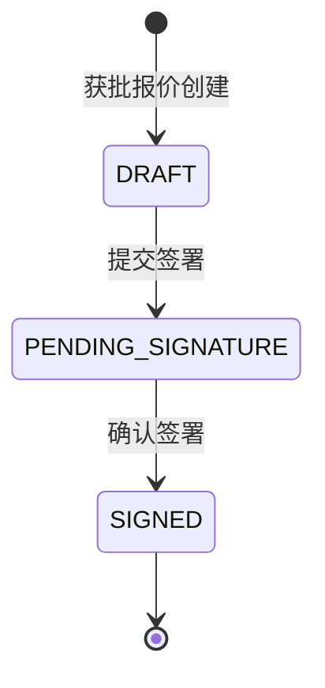
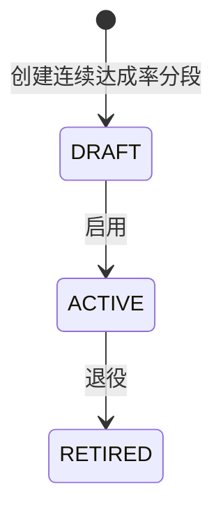
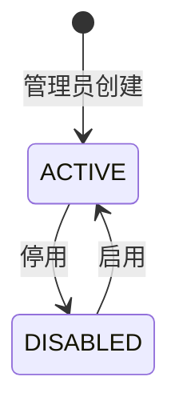
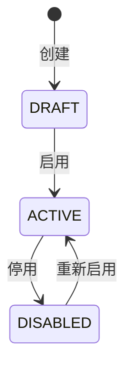
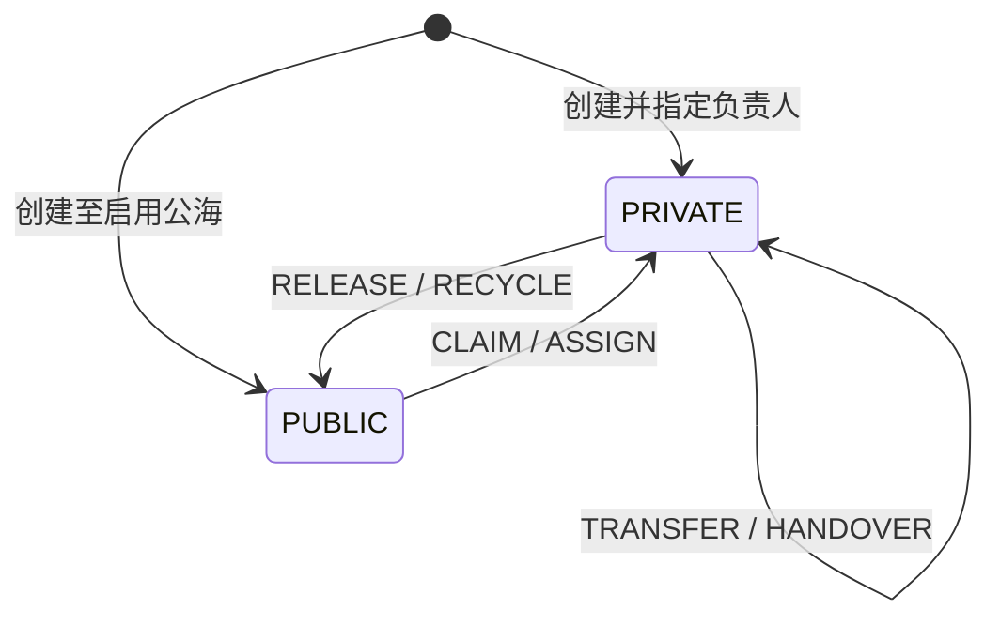

# 状态机与销售业务规则

业务状态与归属状态正交。命令必须先校验业务终态，再校验归属、公海动作开关、权限和版本；任何失败都不得留下部分历史或 Outbox。

## 线索状态机

- `INVALID` 必须有非空 `invalid_reason`，且 `customer_id` 为空。
- `CONVERTED` 必须有同租户 `customer_id`，且无无效原因。
- `INVALID/CONVERTED` 为终态，不得再认领、释放、分配、转移、回收、转换、作废或跟进。客户合并事务可以改写已转换线索的 `customer_id`。

## 客户状态机

客户主数据状态仅为 `ACTIVE/INACTIVE`；`PRIVATE/PUBLIC` 属于归属状态，不混入 `status`。合并不是可恢复状态：源客户设置 `merged_into_customer_id/merged_at` 并软删除，目标客户必须为同租户、未删除、未被合并的 `ACTIVE` 客户。

首期同租户不允许两个活跃客户名称忽略大小写后相同。发现疑似重复时必须走合并，不允许绕过唯一索引加空格或把重复信息塞进扩展字段。

## 商机状态机

商机归属于创建人私海，不进入公海。`stage` 描述销售推进位置，`status` 只表示是否已形成赢单或输单终态；二者由数据库组合约束同时保护。

- `OPEN` 只能使用五个进行中阶段，不得有输单或赢单时间；`WON` 必须为 `CLOSED_WON`、概率 100 且有 `won_at`；`LOST` 必须为 `CLOSED_LOST`、有 `lost_reason/lost_at`。
- 创建、阶段推进、赢单、输单和重启均要求乐观锁版本一致；只有 `LOST` 可重启，`WON` 不可逆。
- 每个动作写一条不可变 `crm_opportunity_stage_history`，并在同一事务写审计与 Outbox；数据库拒绝无历史或审计的阶段、状态、概率变更。

## 报价状态机

报价根状态和当前报价版本状态保持一致；报价版本固化产品和价格快照，不能用后续目录变更修订历史报价。

- 创建仅允许引用进行中或赢单商机和生效价目表；成交价必须落在价格项的目录价和最低价范围内。
- 提交同时校验报价根 `rootVersion` 与当前版本 `version`，并要求启用的审批定义；重复提交由 `Idempotency-Key` 返回首次结果。审批任务通过或驳回时使用实例与任务乐观锁，报价状态在同一事务同步。
- 撤回审批要求实例处于 `PENDING` 且为申请人或审批管理员，报价根和当前版本恢复 `DRAFT`。审批中报价不可直接过期。
- `REJECTED`、`EXPIRED`、`APPROVED` 的版本以及全部报价行不可更新或删除。重新报价必须新增版本，不能修改历史行。

## 合同签署状态机

合同是获批报价的商业快照，不是报价的可编辑副本。一个同租户报价版本最多创建一个未删除合同；创建、签署状态变更均写审计与 Outbox。

- 创建前必须同时校验报价根和当前版本均为 `APPROVED`，并复制所有报价行、金额、税率、币种与产品标识快照。
- 提交签署只能从 `DRAFT` 执行，确认签署只能从 `PENDING_SIGNATURE` 执行；请求中的合同 `version` 必须匹配。受影响记录为 0 时统一返回 `409`。
- 合同支持 `PENDING_SIGNATURE -> DRAFT` 撤回签署，以及从 `DRAFT/PENDING_SIGNATURE/SIGNED` 作废；作废必须说明原因，已签合同存在未取消订单时拒绝作废。合同变更仅记录名称和有效期的拟变更快照，批准不改写原合同或订单。

## 销售订单草稿

已签合同可创建一张完整销售订单草稿。订单行复制合同快照，创建后不会被合同、报价、产品或价目表的后续变更回写。

- 创建前必须验证合同状态为 `SIGNED`；同一租户、同一未删除合同最多拥有一张订单，重复创建返回 `409`，相同 `Idempotency-Key` 返回首次响应。
- 订单支持 `DRAFT -> CONFIRMED`、`CONFIRMED -> CANCELLING -> CANCELLED` 及取消驳回回到 `CONFIRMED`；仅已确认订单可凭非空原因手工关闭。库存、实际发货、回款、开票和售后始终不属于 CRM。

## 绩效评分规则状态机

- 启用仅接受带匹配 `version` 的草稿规则；规则必须有从 0 连续覆盖到无上限的分段，非最终分段上限为排他的下一分段下限。
- `ACTIVE` 和 `RETIRED` 规则及其分段均不可修改或删除。退役只阻止新销售目标绑定，不能阻止已绑定且尚未确认的目标按原规则生成一次评分快照。
- 销售目标结果和评分均为一次性确认事实，确认后不因规则、合同、订单或负责人后续变化而回写。

## 连接器状态机

- 状态命令要求 `connector:manage` 与匹配的 `version`。`ACTIVE` 才能验证共享密钥并接收事件。
- 营销事件只允许创建配置公海中的 CRM 线索；组织事件只保存接收回执，不能创建或更新 CRM 用户、部门、角色和权限。
- 事件以连接器和外部事件号唯一，接收记录为追加式事实；相同编号但不同载荷拒绝。

## 获客渠道状态机

- 只有 `ACTIVE` 渠道可用于创建新线索；线索的 `sourceType` 必须等于渠道配置的来源类型。
- 创建需要 `Idempotency-Key`，启用和停用要求 `channel:manage` 与匹配 `version`。每次变更写审计和 Outbox。
- 渠道 ID 与编码在写入线索时形成归因快照，后续状态或显示名称变更不回写历史线索。

## 销售会话状态机

`OPEN -> CLOSED -> OPEN`。会话必须绑定 CRM 客户，可选绑定该客户的联系人；仅打开状态可追加 `INBOUND/OUTBOUND/NOTE` 沟通记录。记录为追加式事实，CRM 不同步呼叫中心或在线客服的原始会话。

## 私海/公海归属状态机

| 操作 | 前置条件 | 原子结果 | 历史动作 |
|---|---|---|---|
| 认领 | 公海启用、`claim_enabled`、版本和池一致 | 当前用户成为负责人，部门取用户当前部门，清空池 | `CLAIM` |
| 释放 | 私海非终态、目标池启用且 `release_enabled` | 清负责人/部门，写池和 `pool_entered_at` | `RELEASE` |
| 分配 | `assign` 权限、池启用且 `assign_enabled`、目标用户同租户启用 | 目标用户成为负责人 | `ASSIGN` |
| 转移 | 私海非终态、目标用户同租户启用、版本一致 | 改负责人和负责人部门 | `TRANSFER` |
| 规则回收 | 私海非终态、启用的自动回收目标池、超过 `recycle_after_days` | 进入该资源类型唯一的自动回收目标池 | `RECYCLE` |
| 离职交接 | 原/新用户同租户、新用户启用、批次未处理 | 逐资源转移并写交接事实 | `HANDOVER` |

聚合更新条件至少包含 `tenant_id + id + version + 当前归属关键字段`，受影响行为 0 时返回冲突。自动回收以 `coalesce(last_follow_up_at, created_at)` 为最后有效时间，按页使用 `FOR UPDATE SKIP LOCKED` 避免多实例重复处理。每租户、每资源类型最多配置一个启用的自动回收目标池；迁移后定时任务默认关闭，必须在规则验收后显式开启。公海停用需原子设置 `status=0` 和三个手工动作开关为 false；已在池中的记录保留，但不能再认领或分配。规则内容不可原地修改：停用旧版本并用新 ID 插入递增 `rule_version/effective_from`。

## 线索转客户

1. 要求有效私海线索、操作者可写、预期版本一致、幂等键有效。
2. 若关联现有客户，必须同租户且目标有效；若新建，先执行客户名称唯一规则并生成 `customer_no`。
3. 新客户继承线索负责人、负责人部门和必要来源信息；敏感字段按字段权限复制。
4. 同一事务写客户（如新建）、线索 `CONVERTED/customer_id`、两侧历史/审计及 `CustomerCreated/LeadConverted` Outbox。
5. 重复幂等请求返回第一次结果；不同请求复用键返回 409。

## 客户合并

1. 源和目标必须同租户、不同 ID、均有效且版本匹配；名称冲突以目标为准，字段冲突由请求显式选择，禁止静默覆盖。
2. 同一事务把源客户联系人、客户跟进、已转换线索引用迁至目标；联系人保留 `source_customer_id`。
3. 源客户设置目标、合并时间并软删除；目标保持有效。合同等后续跨域引用不在本库事务级联，由 `CustomerMerged` 事件和对账处理。
4. 写 `MERGE` 历史、前后快照审计和 Outbox。任一步失败全部回滚。

## 离职交接

交接请求以 `batch_no + Idempotency-Key` 唯一标识，先校验目标用户同租户且启用，并在同一事务中停用来源用户以阻止新分配；随后分页锁定其可交接的私海线索/客户。每条资源使用版本条件更新，分别写 `crm_resource_handover`、`HANDOVER` 历史、审计与 Outbox；发生越权或版本冲突时整体回滚，来源用户也会恢复原状态，之后可使用新请求重试。已转换或无效线索属于历史记录，不参与负责人交接。
