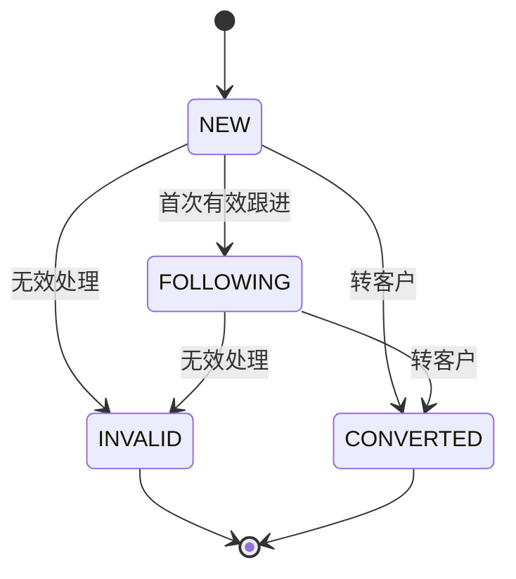
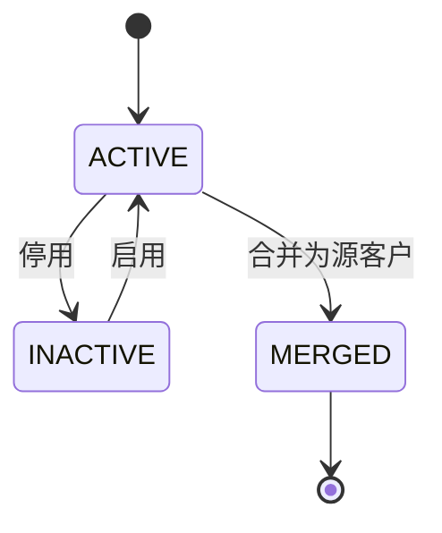
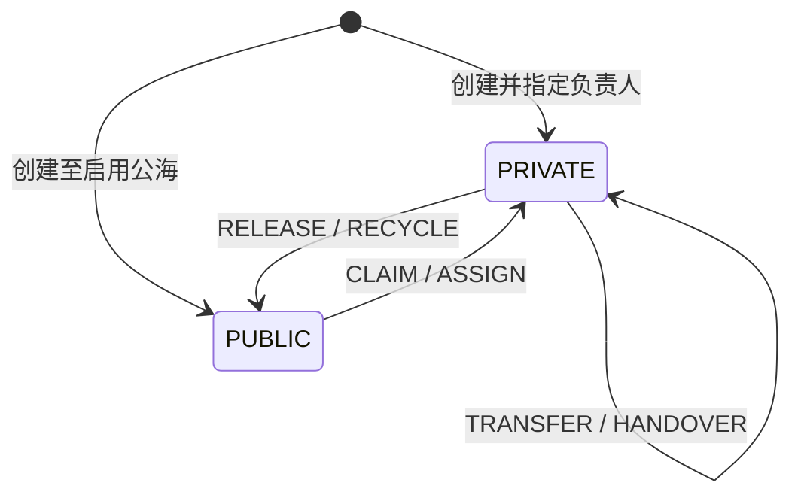

# 状态机与销售业务规则

业务状态与归属状态正交。命令必须先校验业务终态，再校验归属、公海动作开关、权限和版本；任何失败都不得留下部分历史或 Outbox。

## 线索状态机

- `INVALID` 必须有非空 `invalid_reason`，且 `customer_id` 为空。
- `CONVERTED` 必须有同租户 `customer_id`，且无无效原因。
- `INVALID/CONVERTED` 为终态，不得再认领、释放、分配、转移、回收、转换、作废或跟进。客户合并事务可以改写已转换线索的 `customer_id`。

## 客户状态机

客户主数据状态仅为 `ACTIVE/INACTIVE`；`PRIVATE/PUBLIC` 属于归属状态，不混入 `status`。合并不是可恢复状态：源客户设置 `merged_into_customer_id/merged_at` 并软删除，目标客户必须为同租户、未删除、未被合并的 `ACTIVE` 客户。

首期同租户不允许两个活跃客户名称忽略大小写后相同。发现疑似重复时必须走合并，不允许绕过唯一索引加空格或把重复信息塞进扩展字段。

## 私海/公海归属状态机

| 操作 | 前置条件 | 原子结果 | 历史动作 |
|---|---|---|---|
| 认领 | 公海启用、`claim_enabled`、版本和池一致 | 当前用户成为负责人，部门取用户当前部门，清空池 | `CLAIM` |
| 释放 | 私海非终态、目标池启用且 `release_enabled` | 清负责人/部门，写池和 `pool_entered_at` | `RELEASE` |
| 分配 | `assign` 权限、池启用且 `assign_enabled`、目标用户同租户启用 | 目标用户成为负责人 | `ASSIGN` |
| 转移 | 私海非终态、目标用户同租户启用、版本一致 | 改负责人和负责人部门 | `TRANSFER` |
| 规则回收 | 私海非终态、启用的自动回收目标池、超过 `recycle_after_days` | 进入该资源类型唯一的自动回收目标池 | `RECYCLE` |
| 离职交接 | 原/新用户同租户、新用户启用、批次未处理 | 逐资源转移并写交接事实 | `HANDOVER` |

聚合更新条件至少包含 `tenant_id + id + version + 当前归属关键字段`，受影响行为 0 时返回冲突。自动回收以 `coalesce(last_follow_up_at, created_at)` 为最后有效时间，按页使用 `FOR UPDATE SKIP LOCKED` 避免多实例重复处理。每租户、每资源类型最多配置一个启用的自动回收目标池；迁移后定时任务默认关闭，必须在规则验收后显式开启。公海停用需原子设置 `status=0` 和三个手工动作开关为 false；已在池中的记录保留，但不能再认领或分配。规则内容不可原地修改：停用旧版本并用新 ID 插入递增 `rule_version/effective_from`。

## 线索转客户

1. 要求有效私海线索、操作者可写、预期版本一致、幂等键有效。
2. 若关联现有客户，必须同租户且目标有效；若新建，先执行客户名称唯一规则并生成 `customer_no`。
3. 新客户继承线索负责人、负责人部门和必要来源信息；敏感字段按字段权限复制。
4. 同一事务写客户（如新建）、线索 `CONVERTED/customer_id`、两侧历史/审计及 `CustomerCreated/LeadConverted` Outbox。
5. 重复幂等请求返回第一次结果；不同请求复用键返回 409。

## 客户合并

1. 源和目标必须同租户、不同 ID、均有效且版本匹配；名称冲突以目标为准，字段冲突由请求显式选择，禁止静默覆盖。
2. 同一事务把源客户联系人、客户跟进、已转换线索引用迁至目标；联系人保留 `source_customer_id`。
3. 源客户设置目标、合并时间并软删除；目标保持有效。合同等后续跨域引用不在本库事务级联，由 `CustomerMerged` 事件和对账处理。
4. 写 `MERGE` 历史、前后快照审计和 Outbox。任一步失败全部回滚。

## 离职交接

交接请求以 `batch_no + Idempotency-Key` 唯一标识，先校验目标用户同租户且启用，并在同一事务中停用来源用户以阻止新分配；随后分页锁定其可交接的私海线索/客户。每条资源使用版本条件更新，分别写 `crm_resource_handover`、`HANDOVER` 历史、审计与 Outbox；发生越权或版本冲突时整体回滚，来源用户也会恢复原状态，之后可使用新请求重试。已转换或无效线索属于历史记录，不参与负责人交接。
