# CRM 系统整体业务闭环与架构设计

## 1. 文档概览

| 项目 | 内容 |
|---|---|
| 文档定位 | CRM 产品、业务与技术全景设计 |
| 目标读者 | 产品、研发、测试、实施、销售运营及管理人员 |
| 适用组织 | 具有多部门协同、较长销售周期和持续客户经营需求的 B2B 企业 |
| 核心主线 | 渠道获客 → 线索 → 客户与联系人 → 商机 → 报价 → 合同 → 订单 → 交付 → 回款与开票 → 售后 → 复购 |
| 技术形态 | Java Spring Boot 模块化单体 |
| 文档边界 | 定义系统级业务、功能、数据、集成和技术边界，不展开具体接口字段及数据库表结构 |

### 1.1 产品定位

本系统是一套面向 B2B 企业销售团队的客户关系管理平台。系统以客户主数据为核心，连接获客、销售、商务、交付、财务协同和售后服务，确保每条线索有归属、每次跟进可追溯、每个商机有阶段、每笔交易有关联、每项服务有闭环。

系统通过明确的业务状态、审批流程、规则引擎、定时任务和统计口径提升协作效率。所有业务结论必须来源于真实业务数据、用户录入或已发布的确定性规则。

### 1.2 建设目标

1. 建立从获客到复购的统一客户生命周期，减少跨部门数据断点。
2. 统一客户、联系人和交易数据，避免重复建档与资源流失。
3. 规范商机、报价、合同、订单、交付、回款和售后的业务流转。
4. 通过待办、提醒、审批、规则分配和公海回收提高过程执行率。
5. 为管理层提供口径一致、可追溯的经营数据。
6. 通过权限、审计和数据隔离保障客户资产及敏感信息安全。

### 1.3 范围边界

**系统负责：**

- 渠道与线索归因、线索分配、公海管理和转化。
- 客户、联系人、协作关系和跟进记录。
- 商机阶段、报价、合同、销售订单和交付协调。
- 回款计划、到账结果展示、开票申请和发票结果展示。
- 售后工单、退货申请、退款协同、满意度及复购机会。
- 产品与价格资料、统计分析、目标绩效和系统配置。

**外部系统负责：**

- ERP 负责库存、出入库、实际发货和履约结果。
- 财务系统负责到账核销、正式发票、红冲和会计处理。
- 组织系统负责权威部门、岗位、人员和离职状态。
- 工商数据服务提供合法授权范围内的企业登记原始信息。

**本设计不包含：**

- 库存成本核算、总账、凭证、税务申报等财务核算能力。
- 生产计划、采购、仓储作业等 ERP 核心能力。
- 未经授权的个人信息采集、外部联系方式补全或平台规则规避。

## 2. 用户角色与权限边界

### 2.1 角色职责

| 角色 | 核心职责 | 主要功能范围 |
|---|---|---|
| 销售人员 | 承接线索、维护客户、推进商机、提交报价和合同 | 个人及获授权协作的数据 |
| 销售经理 | 分配资源、审核过程、管理目标、复盘团队 | 本部门及下级部门数据 |
| 销售运营 | 配置渠道、销售流程、规则和统计口径 | 业务配置及授权经营数据 |
| 商务人员 | 管理报价、合同、订单及变更 | 商务单据与关联客户数据 |
| 交付人员 | 接收订单、协调交付、登记验收 | 已分配的交付任务及必要客户信息 |
| 财务人员 | 审核回款与开票事项、同步财务结果 | 合同、订单、回款和发票数据 |
| 售后人员 | 受理工单、退货、退款协同和客户反馈 | 已分配工单及必要客户信息 |
| 管理层 | 查看经营结果、漏斗、目标和风险 | 授权组织范围内的汇总及明细 |
| 系统管理员 | 租户、组织、用户、角色、权限、集成和审计 | 系统配置，不默认拥有业务数据查看权 |

### 2.2 权限模型

权限由“功能权限 + 数据范围 + 字段权限 + 操作条件”共同决定：

- **功能权限**：控制菜单、页面、按钮和导入导出能力。
- **数据范围**：支持本人、本部门、本部门及下级、指定组织、全部数据。
- **字段权限**：对手机号、邮箱、证件信息、银行信息、价格、毛利等字段设置可见、脱敏或隐藏。
- **操作条件**：结合单据状态、负责人、审批节点和金额阈值判断是否允许操作。
- **临时授权**：协作人和代理人仅在授权期限及对象范围内获得权限。
- **管理约束**：管理员负责配置和运维；查看业务数据需单独授予业务角色。

## 3. 端到端业务闭环

### 3.1 总体流程

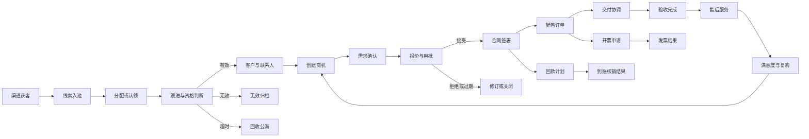

### 3.2 闭环原则

1. 线索转为客户后保留原渠道、活动、分配和跟进历史。
2. 客户是交易与服务的统一主数据，联系人从属于客户。
3. 商机必须关联客户；报价、合同和订单必须关联商机或记录例外原因。
4. 合同审批通过后方可生成正式销售订单；特殊补录需具备单独权限和审计。
5. 订单可拆分多个交付任务，交付结果由 ERP 或交付人员回写。
6. 回款计划由 CRM 管理，实际到账和核销结果以财务系统为准。
7. 开票申请由 CRM 发起，正式发票和红冲结果以财务系统为准。
8. 售后工单必须关联客户，并尽可能关联订单、交付或产品。
9. 所有转移、合并、变更、作废、冲销和删除均保留操作日志。

## 4. 功能与菜单架构

### 4.1 功能架构

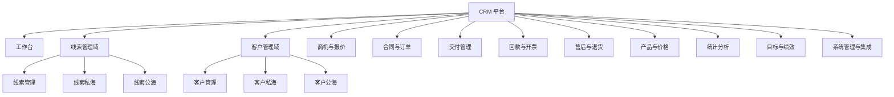

### 4.2 一级功能域矩阵

| 功能域 | 业务目标 | 主要对象 | 核心功能 | 关键操作 | 主要输出或规则 |
|---|---|---|---|---|---|
| 工作台 | 汇总个人和团队当日工作 | 待办、任务、提醒、审批 | 待办中心、日程、跟进计划、经营概览 | 完成、转交、延期、进入业务详情 | 来源于业务状态、用户计划和已发布规则 |
| 线索管理域 | 统一承接并转化潜在客户 | 线索、渠道、活动、归属状态 | 线索管理、线索私海、线索公海 | 新增、分配、认领、释放、转化、标记无效 | 分配、回收、重复、保有量和触达时限规则 |
| 客户管理域 | 沉淀统一客户资产 | 客户、联系人、标签、协作人、归属状态 | 客户管理、客户私海、客户公海 | 新增、转移、认领、合并、释放、创建商机 | 唯一性、保有量、回收和数据完整度规则 |
| 商机与报价 | 规范销售推进和价格承诺 | 商机、阶段、产品明细、报价单 | 阶段管理、跟进、报价、折扣审批、输赢单 | 推进、暂停、重启、报价、赢单、输单 | 阶段准入、停留时限、报价有效期 |
| 合同与订单 | 固化交易约定并启动履约 | 合同、补充协议、订单 | 起草、审批、签署、变更、订单生成 | 提交、撤回、签署、变更、作废 | 审批矩阵、金额校验、版本留存 |
| 交付管理 | 协调发货、实施和验收 | 交付任务、发货信息、验收记录 | 拆单、排期、进度、交付回写、验收 | 分配、更新、延期、完成、验收 | 订单数量约束、延期提醒、结果同步 |
| 回款与开票 | 管理资金计划及票据申请 | 回款计划、到账记录、开票申请、发票 | 计划、提醒、到账同步、开票审批、红冲结果 | 登记计划、认领到账、申请开票、查看发票 | 金额上限、逾期、核销和开票校验 |
| 售后与退货 | 闭环客户问题与逆向履约 | 工单、退货单、退款记录、评价 | 受理、分派、升级、解决、退货、退款协同 | 接单、转派、关闭、退货审批、评价 | 服务时限、升级、退货数量和退款校验 |
| 产品与价格 | 统一销售标的和价格依据 | 产品、分类、价目表、折扣政策 | 产品资料、价格版本、组合、上下架 | 新增、发布、调价、停用 | 生效期、客户级价格、折扣权限 |
| 统计分析 | 提供统一经营事实 | 指标、报表、看板、导出任务 | 漏斗、业绩、回款、产品、渠道、服务统计 | 筛选、下钻、导出、订阅 | 固定公式、权限过滤、统计快照 |
| 目标与绩效 | 将目标与业务结果关联 | 目标、指标、模板、考核结果 | 目标分解、规则计分、结果确认、版本管理 | 配置、发布、计算、申诉、确认 | 生效版本、数据快照、人工调整审计 |
| 系统管理与集成 | 支撑组织、权限、规则和外部协同 | 租户、组织、用户、角色、流程、连接配置 | 权限、字典、表单、规则、审批、通知、集成、审计 | 配置、发布、停用、重试、查询日志 | 多租户隔离、配置版本、失败重试 |

### 4.3 线索与客户菜单划分

线索和客户各自采用“管理总览 + 私海 + 公海”的三级页面结构。管理总览是按权限查询和治理资源的入口，不表示第三种资源归属；一条有效资源在同一时刻只能属于私海或公海。

| 业务域 | 菜单页面 | 定位 | 默认数据范围 | 核心操作 |
|---|---|---|---|---|
| 线索管理域 | 线索管理 | 线索总览及运营管理入口 | 用户被授权组织范围内的全部线索 | 新增、导入、查重、分配、转移、批量打标签、导出 |
| 线索管理域 | 线索私海 | 销售日常跟进本人负责的线索 | 当前用户负责的线索；协作线索单独标识 | 写跟进、编辑、转化、标记无效、释放公海 |
| 线索管理域 | 线索公海 | 存放暂时无负责人的可分配线索 | 用户有权查看和认领的公海范围 | 认领、批量认领、管理员分配、查看受限详情 |
| 客户管理域 | 客户管理 | 客户主数据总览及治理入口 | 用户被授权组织范围内的全部客户 | 新增、导入、查重、合并、转移、分级、导出 |
| 客户管理域 | 客户私海 | 销售维护本人负责的客户资产 | 当前用户负责的客户；协作客户单独标识 | 写跟进、维护联系人、创建商机、添加协作人、释放公海 |
| 客户管理域 | 客户公海 | 存放暂时无负责人的可认领客户 | 用户有权查看和认领的公海范围 | 认领、批量认领、管理员分配、查看受限详情 |

**统一归属规则：**

- 私海资源必须有唯一负责人；协作人不改变负责人及私海归属。
- 公海资源没有负责人，但必须记录所属公海、进入原因、进入时间和原负责人。
- 认领或分配成功后，资源从公海移入接收人的私海，并生成负责人变更记录。
- 主动释放或规则回收成功后，资源从私海移入指定公海，原跟进和归属历史完整保留。
- 管理总览按权限同时展示私海、公海及归档数据，并明确展示归属状态，不复制业务记录。
- 公海列表默认隐藏或脱敏关键联系方式；认领后按用户字段权限展示。

## 5. 各功能域详细设计

### 5.1 工作台

**业务目标：**让用户在一个入口了解今天需要处理的事项，并快速进入对应业务对象。

**页面组成：**

- 我的待办：待跟进线索、客户回访、商机阶段超时、报价过期、合同审批、交付延期、回款到期、售后工单。
- 我的日程：用户创建的拜访、电话、会议和任务，支持日、周、月视图。
- 重点事项：用户手动置顶或管理者标记的客户、商机和订单。
- 经营概览：按权限展示客户、商机、签约、回款和工单的当前周期数据。
- 快捷入口：新增线索、客户、商机、报价、合同、跟进记录和售后工单。

**规则：**

- 待办由业务状态、截止时间和已发布规则生成，不自动替用户作出业务判断。
- 完成业务动作后，对应待办同步关闭；仅关闭提醒不改变业务对象状态。
- 转交、延期和批量完成必须记录操作人、时间和原因。

### 5.2 线索管理域

**业务目标：**统一接收潜在客户信息，保证及时分配、跟进和转化。

#### 5.2.1 线索管理

- 支持手工新增、模板导入、营销平台同步、渠道事件写入和接口接入。
- 按手机号、邮箱、企业名称、统一社会信用代码及渠道身份执行重复校验。
- 面向销售经理、销售运营和获授权管理人员提供线索总览。
- 支持管理员分配、规则分配、跨部门转移、批量标签、数据校正和导出。
- 列表明确展示负责人、协作人、归属状态、所属公海、最近跟进时间和下次跟进时间。
- 管理页操作仍受组织数据范围、字段权限和当前线索状态约束。

#### 5.2.2 线索私海

- 展示当前用户负责的有效线索，并将协作线索作为独立筛选项展示。
- 支持编辑、写跟进、添加标签、设置下次跟进、转化、标记无效和释放公海。
- 跟进记录包含方式、内容、结果、附件、下次跟进时间和记录人。
- 有效线索转为客户时，可同时创建联系人和首个商机。
- 私海数量受个人或角色保有量限制；达到上限后不得继续认领公海线索。

#### 5.2.3 线索公海

- 接收尚未分配、主动释放、离职释放和规则回收的线索。
- 公海可按组织、区域、行业、产品线或渠道划分，并配置可见及可认领范围。
- 销售可认领单条或批量线索，管理人员可直接分配或转移至其他公海。
- 认领前校验线索状态、用户权限、认领上限和私海保有量，并使用并发控制避免重复认领。
- 公海中不得直接写业务跟进；用户需先认领，管理人员进行数据治理的操作除外。

**关键状态：**待分配、待跟进、跟进中、已转化、无效、已回收。

**逆向处理：**

- 无效线索必须选择原因，可由授权人员恢复为待跟进。
- 私海线索超时后按规则回收至指定线索公海，并保留原负责人和历史记录。
- 重复线索可合并、关联已有客户或保留并说明原因。

### 5.3 客户管理域

**业务目标：**建立唯一、完整、可继承的客户档案。

#### 5.3.1 客户管理

- 维护基本信息、工商登记原始信息、地址、行业、规模、来源、等级和负责人。
- 管理多个联系人、部门、职务、决策角色、联系方式和有效状态。
- 汇总线索来源、跟进、商机、报价、合同、订单、交付、回款、发票和售后记录。
- 支持从合规数据服务查询企业登记信息，经用户确认后写入档案。
- 面向销售经理、销售运营和获授权管理人员提供客户总览、查重、合并、分级、转移和导出。
- 列表明确展示负责人、协作人、归属状态、所属公海、最近跟进时间和客户等级。

#### 5.3.2 客户私海

- 展示当前用户负责的客户，并将协作客户作为独立筛选项展示。
- 支持写跟进、维护联系人、添加标签、调整分级、添加协作人和创建商机。
- 支持查看关联商机、报价、合同、订单、交付、回款、发票和售后记录。
- 私海数量受个人或角色客户保有量限制。
- 主动释放前必须通过在途业务校验；不满足释放条件时应先转移负责人或完成相关业务。

#### 5.3.3 客户公海

- 接收尚未分配、主动释放、离职释放和规则回收的客户。
- 客户公海可独立于线索公海配置可见部门、认领角色、认领上限和保护期。
- 销售可认领单条或批量客户，管理人员可直接分配或转移至其他客户公海。
- 认领前校验用户权限、客户状态、私海保有量及是否存在锁定中的分配操作。
- 公海保留客户历史负责人、跟进记录及交易关系，但关键联系方式按字段权限脱敏。

**关键规则：**

- 企业客户优先以统一社会信用代码校验唯一性；缺失时使用企业名称和联系方式组合校验。
- 合并后保留主客户，联系人及业务记录迁移到主客户，原客户进入合并归档状态。
- 客户释放至客户公海前校验是否存在进行中的商机、待履约订单、未完成回款责任或未关闭工单。
- 线索转化后默认进入转化人的客户私海；未指定负责人或转化人无承接权限时进入指定客户公海。

### 5.4 商机与报价

**业务目标：**以可配置阶段推动销售过程，以受控报价形成对外价格承诺。

**默认商机阶段：**

1. 初步接洽。
2. 需求确认。
3. 方案与报价。
4. 商务谈判。
5. 赢单或输单。

每个阶段可配置必填字段、完成条件、默认赢率和最大停留天数。默认赢率只用于确定性加权管道统计，不代表成交承诺。

**商机功能：**

- 维护预计金额、预计签约日、产品明细、竞争情况、决策链和协作成员。
- 记录跟进、阶段变更、支持申请、暂停、重启、赢单和输单复盘。
- 阶段推进前校验必填项；回退阶段必须填写原因。
- 输单后允许授权用户重启，重启保留原输单原因及历史阶段。

**报价功能：**

- 从产品、价目表、税率、数量和折扣生成报价明细。
- 支持报价模板、版本、审批、有效期、附件、发送记录和客户反馈。
- 超过折扣或毛利阈值时进入指定审批流。
- 报价可被接受、拒绝、撤回或过期；修订报价创建新版本，不覆盖已发送版本。

### 5.5 合同与订单

**业务目标：**将已确认的交易条件固化为可审计合同，并形成履约依据。

**合同功能：**

- 起草合同，关联客户、商机、报价、产品明细、金额、付款条件和有效期。
- 支持多级审批、会签、撤回、驳回、签署、归档和附件管理。
- 合同变更通过补充协议或新版本完成，记录变更前后差异。
- 合同作废需校验订单、回款和开票状态；无法直接作废时进入异常处理流程。

**订单功能：**

- 合同审批并签署后生成销售订单，继承客户、产品、价格、税率和付款条件。
- 支持一个合同生成多个订单，也支持授权用户补录无合同订单并说明原因。
- 订单状态包括草稿、待确认、待交付、交付中、已完成、已取消。
- 已发生交付、回款或开票的订单不得直接删除，只能取消未履约部分并保留历史。

### 5.6 交付管理

**业务目标：**在 CRM 中持续跟踪客户可见的履约进度，不替代 ERP 的仓储和生产作业。

**核心功能：**

- 按订单产品、数量、交付地点或实施阶段拆分交付任务。
- 维护计划日期、负责人、交付方式、里程碑、附件和客户验收信息。
- 接收 ERP 回传的备货、出库、发货、签收或实施完成结果。
- 支持延期登记、异常说明、责任人转交和客户验收。

**规则：**

- 累计交付数量不得超过订单有效数量。
- ERP 为实际发货和库存结果的权威来源；人工更正需审批并保留前后值。
- 订单全部有效数量交付且满足验收条件后，订单可进入已完成状态。

### 5.7 回款与开票

**业务目标：**让销售过程可见应收计划、实际到账和票据状态，并与财务权威数据保持一致。

**回款管理：**

- 根据合同付款条件建立一期或多期回款计划。
- 维护计划金额、计划日期、负责人、付款方和提醒策略。
- 接收财务系统到账记录，由财务人员认领并核销到合同、订单及回款计划。
- 支持部分核销、跨计划核销、误认领撤销和到账冲销结果同步。
- 回款计划到期未足额核销时标记逾期，并生成提醒。

**开票管理：**

- 基于合同、订单、交付或回款条件提交开票申请。
- 维护发票类型、抬头、税号、开票项目、金额和收件信息。
- 财务审批后由财务系统完成开票，并回传发票号码、日期、状态及文件。
- 红冲由 CRM 发起申请或接收财务结果；原发票与红冲记录必须关联展示。

**金额约束：**

- 累计回款计划金额不得无理由超过合同应收金额。
- 累计有效开票申请金额不得超过可开票金额。
- 冲销和红冲后重新计算已回款、待回款、已开票和可开票金额。

### 5.8 售后与退货

**业务目标：**统一受理客户问题，完成处理、评价及退货退款闭环。

**售后工单：**

- 工单包含客户、订单、产品、问题类型、优先级、服务时限和问题描述。
- 支持分派、接单、转派、协作、升级、解决、客户确认、关闭和重新打开。
- 记录每次处理动作、附件、耗时、处理结果和满意度评价。
- 达到升级条件或临近服务时限时，按规则通知责任人和管理者。

**退货退款：**

- 从订单或售后工单发起退货，记录产品、数量、原因和客户诉求。
- 经销售、售后、仓库和财务按配置完成审批。
- ERP 回传退货入库数量和质量状态，财务系统回传退款结果。
- 退货数量不得超过可退数量；退款金额不得超过审批通过金额。
- 驳回、取消、部分入库或退款失败均需保留原因并允许继续处理。

### 5.9 产品与价格

**业务目标：**为商机、报价、合同和订单提供统一销售标的及价格依据。

**核心功能：**

- 管理产品分类、编码、名称、规格、单位、税率、状态和资料附件。
- 管理标准价目表、区域价目表、客户级价格、合同价和有效期。
- 管理产品组合、可选项和销售限制。
- 管理折扣政策、审批阈值和生效范围。

**规则：**

- 已被业务单据引用的产品和价格版本不得物理删除。
- 调价必须创建新版本并设置生效时间，历史单据保持原价格快照。
- 下架产品不可用于新单据，但不影响历史查询和存量履约。

### 5.10 统计分析

**业务目标：**基于统一事实数据提供可解释、可核对的经营统计。

| 分析主题 | 核心指标 |
|---|---|
| 获客与线索 | 新增线索、首次触达率、有效率、转化率、渠道成本与贡献 |
| 客户经营 | 新增客户、活跃客户、沉睡客户、流失率、复购率 |
| 商机管道 | 各阶段数量与金额、阶段转化率、赢单率、平均销售周期 |
| 报价合同 | 报价金额、接受率、签约额、折扣分布、毛利率 |
| 订单交付 | 订单金额、交付完成率、准时率、延期数量 |
| 回款开票 | 计划回款、实际回款、逾期率、已开票及可开票金额 |
| 售后服务 | 工单量、首次响应时长、解决时长、重开率、满意度 |
| 人员过程 | 跟进量、拜访量、目标达成率、数据完整度 |

**统计规则：**

- 每项指标必须定义公式、统计时间、数据来源、状态范围和去重方式。
- 看板按当前权限过滤；导出沿用相同权限及脱敏规则。
- 统计快照保留计算时间和口径版本，历史结果不随新口径静默变化。
- 加权管道金额按“商机金额 × 当前阶段配置赢率”计算，不作为成交承诺。

### 5.11 目标与绩效

**业务目标：**将组织目标、个人目标和 CRM 业务结果建立透明、可复核的关联。

**核心功能：**

- 按年度、季度、月度创建签约、回款、新客户和过程目标。
- 支持从公司到部门、团队和个人逐级分解。
- 维护指标库、考核模板、适用角色、权重、目标值和计分方式。
- 支持线性、达标、反向、阶梯和扣分等确定性计分规则。
- 发布前校验权重、目标和生效时间，并用历史快照进行试算。
- 结果生成后支持员工确认、申诉、复核和授权调整。

**版本与审计：**

- 每次发布形成不可变版本，记录发布人、生效时间和变更差异。
- 计算结果关联规则版本及业务数据快照。
- 人工调整必须填写原因、上传依据并记录调整前后分值。
- 绩效模块只读取授权业务数据，不反向修改业务单据。

### 5.12 系统管理与集成

**核心功能：**

- 租户、组织、岗位、用户、角色及权限管理。
- 菜单、字典、编号、表单字段、标签和业务参数配置。
- 商机阶段、公海、保有量、分配、提醒、审批和通知规则配置。
- 消息模板、发送渠道、失败重试和发送日志。
- 外部系统连接、凭证、字段映射、同步任务和异常队列。
- 登录日志、操作日志、审批日志、数据变更日志和导出日志。
- 离职资源盘点、继承方案、交接预览、批量执行和交接记录。

## 6. 核心业务流程

### 6.1 线索转客户

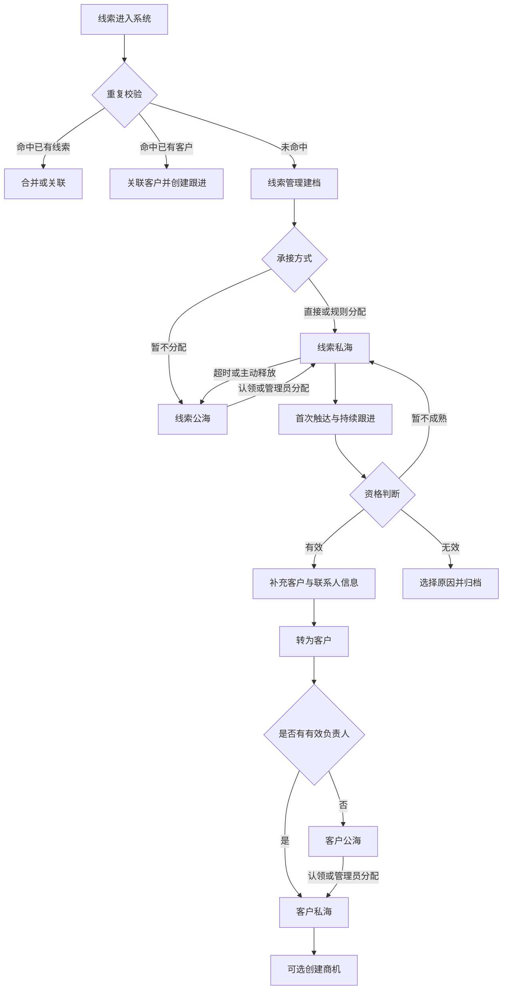

### 6.2 商机到订单

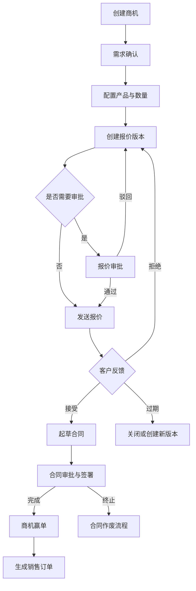

### 6.3 订单交付、回款与开票

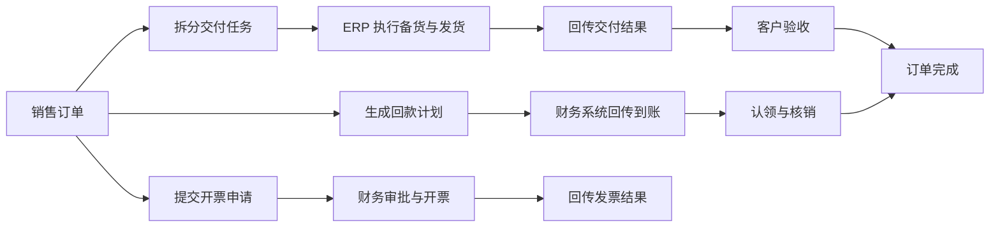

### 6.4 售后到复购

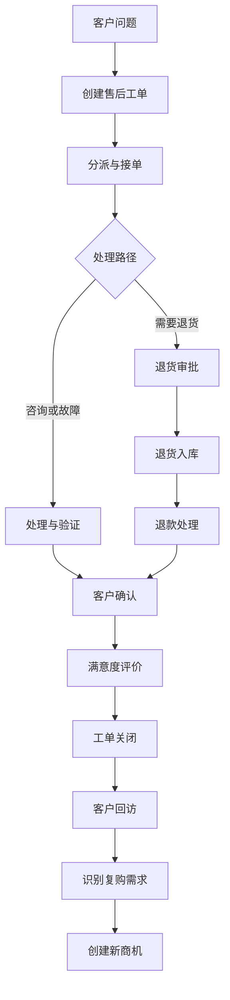

### 6.5 离职资源交接

1. 组织系统同步离职状态或管理员发起离职交接。
2. 系统盘点该人员负责及协作的线索、客户、商机、合同、订单、回款计划、任务和工单。
3. 管理者按资源类型指定继承人；允许将无在途业务的线索或客户释放至公海。
4. 系统展示交接预览，标识不可直接转移的审批任务和进行中协作事项。
5. 确认后批量变更负责人、协作人和待办接收人。
6. 交接结果通知相关人员，并保留每个对象的原负责人、接收人、操作人和时间。

## 7. 关键状态与逆向流程

### 7.1 线索与客户归属状态

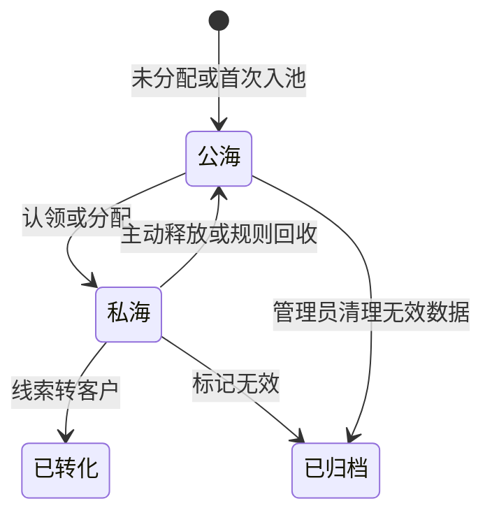

**状态约束：**

- 线索公海与客户公海分别管理，二者的可见范围、认领限制、保护期和回收规则独立配置。
- 私海和公海是互斥归属状态；管理页面只是授权总览，不参与状态流转。
- 私海资源的负责人为空时不得保存；公海资源的负责人必须为空。
- 资源从公海进入私海时记录认领人或分配人，从私海进入公海时记录释放或回收原因。
- 已转化线索退出线索私海和线索公海，其来源及跟进历史通过客户档案继续查询。
- 已归档资源不进入任何公海；恢复后根据负责人是否有效进入对应私海或公海。

### 7.2 商机状态

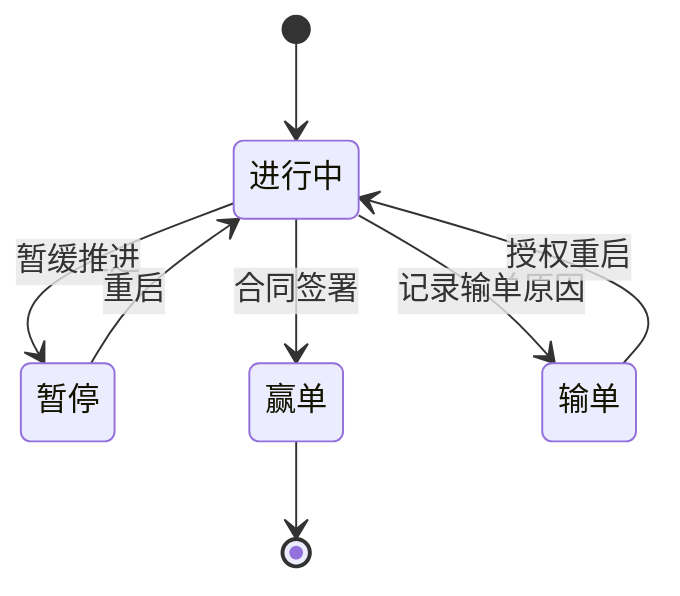

### 7.3 合同与订单状态

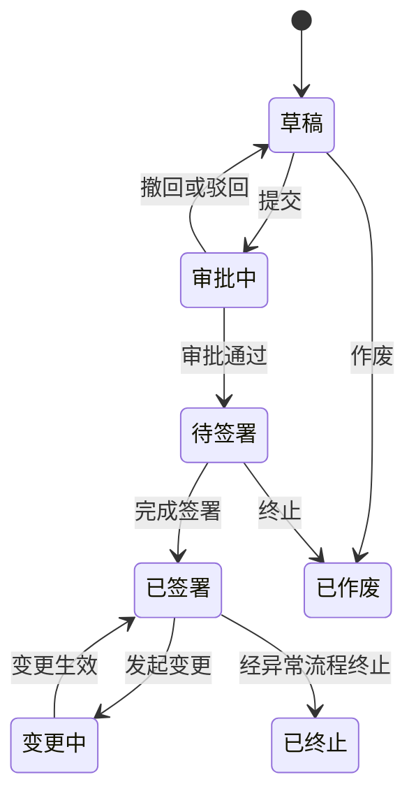

订单取消、退货退款、到账冲销和发票红冲属于独立逆向业务，不删除原单据：

| 逆向事项 | 发起条件 | 处理结果 | 审计要求 |
|---|---|---|---|
| 订单取消 | 未履约或仅取消剩余部分 | 释放未交付数量，保留已履约记录 | 原因、审批、影响金额 |
| 退货 | 存在可退订单数量 | 形成退货单并接收 ERP 入库结果 | 产品、数量、批次、审批链 |
| 退款 | 退货或合同约定成立 | 接收财务退款结果 | 退款金额、账户、关联单据 |
| 到账冲销 | 到账记录错误或银行退回 | 冲减已回款并恢复待回款 | 原到账、冲销凭据、操作人 |
| 发票红冲 | 发票错误或交易调整 | 关联原发票并恢复可开票金额 | 红冲原因、财务结果、附件 |
| 客户合并 | 重复客户确认成立 | 业务关系迁移到主客户 | 合并前后对象及冲突处理 |

## 8. 核心数据架构

### 8.1 业务对象关系

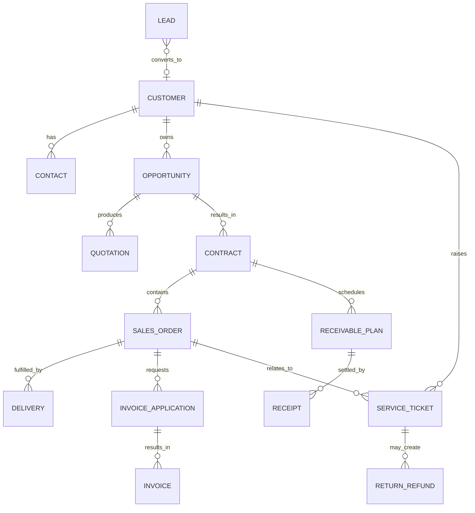

### 8.2 数据主责

| 数据对象 | 权威来源 | CRM 职责 | 关键约束 |
|---|---|---|---|
| 线索 | CRM | 建档、分配、私海跟进、公海流转、转化、审计 | 租户隔离、唯一性、归属状态和负责人 |
| 客户、联系人 | CRM | 主数据维护、私海经营、公海流转、授权、审计 | 租户隔离、唯一性、归属状态和负责人 |
| 商机 | CRM | 创建、阶段推进、输赢单和协作 | 必须关联客户及有效负责人 |
| 产品销售资料、价目表 | CRM 或 ERP 同步 | 销售使用、版本留存 | 来源需按实施方案唯一确定 |
| 合同、销售订单 | CRM | 起草、审批、签署、销售流程管理 | 变更和作废必须留痕 |
| 库存、出库、实际发货 | ERP | 展示结果、关联订单、产生待办 | 不在 CRM 直接修改权威结果 |
| 回款计划 | CRM | 计划、提醒、负责人管理 | 计划金额与合同约束 |
| 实际到账和核销 | 财务系统 | 接收、认领、关联和展示 | 财务结果为准 |
| 开票申请 | CRM | 发起、审批、状态跟踪 | 金额和条件校验 |
| 正式发票、红冲 | 财务系统 | 接收、关联、展示 | 财务结果为准 |
| 退货入库 | ERP | 发起协同、展示结果 | 不超过可退数量 |
| 退款结果 | 财务系统 | 发起协同、展示结果 | 不超过审批金额 |

### 8.3 数据生命周期

- 业务主数据和交易数据采用逻辑删除或状态归档，不允许直接物理删除已被引用的记录。
- 线索和客户分别保存归属状态、负责人、公海标识、进入公海时间及进入原因；管理总览基于同一业务记录查询，不建立副本。
- 附件与业务对象绑定，继承对象的数据权限和保留期限。
- 客户合并、负责人转移和组织变更不改变历史操作人的身份记录。
- 导出文件设置有效期并记录下载人、筛选条件、字段范围和下载时间。
- 达到法定或企业保留期限后，按审批流程归档、匿名化或删除。

## 9. 规则与自动化机制

### 9.1 规则类型

| 规则 | 触发方式 | 典型动作 |
|---|---|---|
| 线索分配 | 线索创建 | 按区域、行业、产品线、轮询或负载分配 |
| 线索公海回收 | 定时扫描 | 将超过期限未跟进的线索从线索私海移入指定线索公海 |
| 客户公海回收 | 定时扫描 | 将满足回收条件且无在途业务的客户从客户私海移入指定客户公海 |
| 保有量 | 认领或分配前 | 分别校验个人或角色的线索私海、客户私海和商机数量上限 |
| 公海保护期 | 认领或回收时 | 限制原负责人或其他人员在保护期内重复认领 |
| 重复校验 | 新增、导入、同步 | 提示、阻止、合并或关联已有对象 |
| 跟进提醒 | 下次跟进时间到达 | 创建待办并发送通知 |
| 阶段超时 | 商机阶段停留超限 | 提醒负责人和管理者 |
| 折扣审批 | 报价提交 | 按折扣、毛利、金额和角色匹配审批流 |
| 回款逾期 | 计划日期到达且未足额核销 | 标记逾期并发送提醒 |
| 服务升级 | 工单临近或超过时限 | 通知上级或转入升级队列 |
| 标签规则 | 业务事件或定时扫描 | 按明确条件添加或移除标签 |

### 9.2 执行约束

- 规则必须具备名称、适用范围、优先级、生效时间、停用时间和版本。
- 发布前检查条件冲突、循环动作及必填参数。
- 同一业务事件使用唯一标识保证重复触发不产生重复分配、重复待办或重复通知。
- 规则执行失败进入重试队列；超过重试上限后进入异常队列并通知管理员。
- 人工操作与规则动作冲突时，以已完成且通过权限校验的最新业务状态为准，禁止覆盖后续有效变更。
- 每次执行记录规则版本、命中条件、执行结果和关联业务对象。

## 10. 外部系统集成

### 10.1 集成矩阵

| 外部系统 | 集成目的 | 写入 CRM | CRM 输出 | 主数据归属 |
|---|---|---|---|---|
| 企业微信、钉钉、Lark | 组织同步、待办通知、移动审批 | 组织、人员、审批结果、沟通记录 | 待办、通知、审批请求 | 组织系统负责组织人员，CRM 负责业务对象 |
| ERP | 产品、库存、发货、退货入库协同 | 产品或库存快照、发货、签收、退货入库 | 销售订单、交付要求、退货申请 | ERP 负责库存和实际履约 |
| 财务系统 | 到账、核销、开票和退款协同 | 到账、核销、发票、红冲、退款结果 | 合同、订单、回款计划、开票及退款申请 | 财务系统负责资金和票据结果 |
| 工商数据服务 | 补充企业登记原始信息 | 企业名称、登记状态、统一社会信用代码等 | 授权查询条件 | 外部服务负责原始数据，用户确认后写入 CRM |
| 呼叫中心或在线客服 | 沉淀客户沟通 | 通话、会话、坐席和结果 | 客户、联系人及工单关联信息 | 各系统保留原始记录，CRM 保存业务关联 |
| 营销平台 | 线索接入与渠道归因 | 线索、活动、来源和成本 | 转化状态及授权范围内的回传数据 | 营销平台负责活动，CRM 负责线索及转化 |

### 10.2 集成通用要求

- 同步接口必须具备租户标识、业务唯一标识、请求时间和幂等标识。
- 接入层完成签名校验、权限校验、限流、字段映射和重复请求处理。
- 同步失败采用有限次数重试；持续失败进入异常队列，支持查看原因和人工重放。
- 冲突数据按主责矩阵处理，不允许通过最后写入时间覆盖权威系统结果。
- 敏感凭证加密存储、定期轮换，并限制查看和导出。
- 所有外部写入记录来源系统、外部编号、同步批次和原始时间。

## 11. 技术架构

### 11.1 总体架构

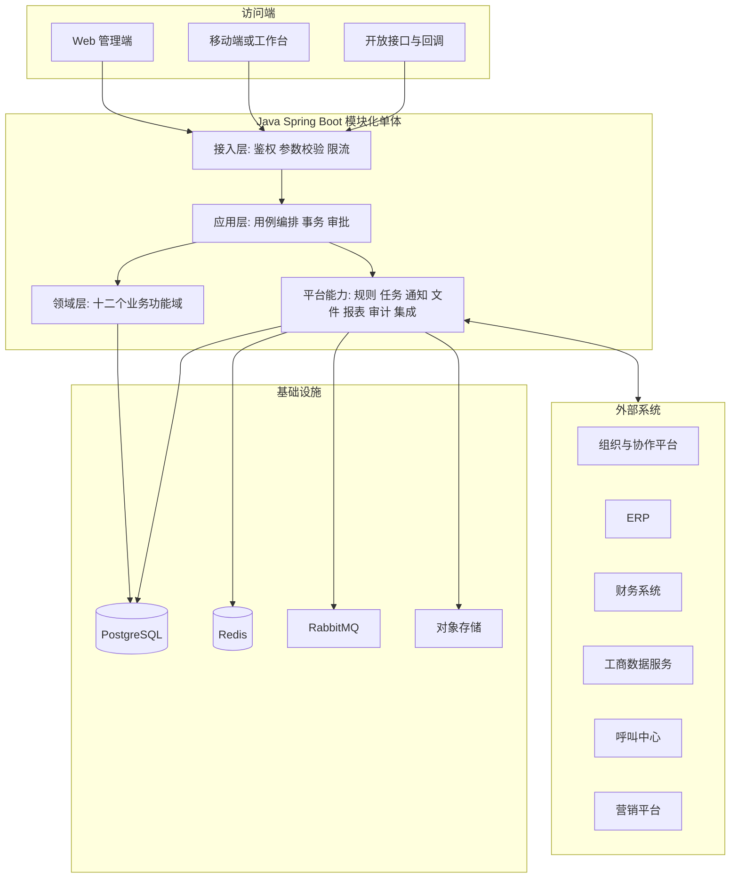

### 11.2 分层职责

| 层级 | 职责 | 约束 |
|---|---|---|
| 访问端 | 业务操作、数据展示、移动待办 | 不直接访问数据库 |
| 接入层 | 认证、授权、参数校验、协议转换、限流 | 不编写跨领域业务规则 |
| 应用层 | 编排用例、控制事务、调用领域能力 | 不绕过领域校验直接修改数据 |
| 领域层 | 实现客户、销售、交易、服务等核心规则 | 领域间通过明确应用服务协作 |
| 平台能力层 | 规则、审批、任务、通知、文件、报表、审计和集成 | 保持通用，不承载特定领域状态判断 |
| 基础设施层 | 数据库、缓存、消息、对象存储和外部连接 | 通过接口适配，避免领域依赖具体实现 |

### 11.3 模块化原则

- 十二个功能域形成独立业务模块，拥有各自的应用服务、领域对象和数据访问边界。
- 跨模块操作由应用层编排，禁止直接修改其他模块的数据表。
- 同一业务事务内采用本地事务；非关键外部同步通过可靠事件异步执行。
- 外部系统不可用时，CRM 主业务先保存可恢复状态，并将同步任务置为待重试。
- 当单个领域的规模、发布频率或性能要求显著独立时，可按现有边界拆分服务。

## 12. 安全、审计与非功能要求

### 12.1 安全要求

- 所有业务数据按租户隔离，服务端不得信任客户端传入的租户范围。
- 使用基于角色的访问控制，并叠加组织数据范围、字段权限和操作条件。
- 手机号、邮箱、证件、银行及价格敏感字段按角色脱敏。
- 登录、权限变更、客户导出、负责人转移、单据审批和金额调整必须审计。
- 传输过程使用加密协议；敏感配置、凭证和必要业务字段加密存储。
- 批量导出、批量转移和高金额审批支持二次确认及权限复核。

### 12.2 非功能要求

| 类别 | 要求 |
|---|---|
| 可用性 | 核心业务月度可用性目标不低于 99.9% |
| 性能 | 常用列表和详情在正常负载下 95% 请求不超过 2 秒；大报表采用异步导出 |
| 一致性 | 核心单据写入使用事务；外部同步采用幂等、重试和补偿机制 |
| 可追溯性 | 关键对象可查看状态历史、审批历史、负责人变化和外部同步记录 |
| 可扩展性 | 业务阶段、字段、规则、审批、字典和通知模板支持配置化 |
| 兼容性 | Web 端适配企业统一支持的主流浏览器；移动工作台采用响应式布局 |
| 备份恢复 | 业务库定期全量与增量备份，附件独立备份，并定期验证恢复流程 |
| 可观测性 | 记录请求、错误、任务、消息积压、同步失败和资源使用指标并配置告警 |

## 13. 典型业务场景

### 13.1 新销售入职

管理员开通账号和角色 → 分配组织及数据范围 → 经理转交客户与商机 → 新销售在工作台接收待办 → 查看完整客户时间线 → 记录跟进并推进商机。

### 13.2 大客户协同销售

创建客户 → 维护多联系人和决策角色 → 添加销售、技术、商务协作人 → 创建商机 → 分阶段推进 → 报价审批 → 合同会签 → 订单交付 → 回款与售后持续跟踪。

### 13.3 月度经营复盘

确认统计周期和口径版本 → 查看渠道至客户转化 → 查看商机管道和阶段转化 → 查看签约、交付、回款及逾期 → 下钻异常单据 → 形成负责人明确的改进任务。

### 13.4 合同变更与订单取消

发起合同变更 → 评估订单、交付、回款和开票影响 → 完成审批 → 生成补充协议及新版本 → 调整未履约订单 → 保留原合同和订单快照。

### 13.5 售后退货退款

售后工单确认需退货 → 创建退货申请 → 多部门审批 → ERP 回传入库 → 财务处理退款 → 回传退款结果 → 工单确认与评价 → 更新客户时间线。

## 14. 文档级验收标准

1. 文档完整覆盖十二个一级功能域，每个功能域均说明目标、主要对象、核心功能、关键操作和规则。
2. 菜单明确包含线索管理、线索私海、线索公海、客户管理、客户私海和客户公海，且六个页面的范围及操作互不混淆。
3. 私海与公海为互斥归属状态，管理页面为授权总览；认领、分配、释放、回收和转化均有明确状态变化。
4. 正向流程从渠道获客连续到售后及复购，所有交易和服务对象能够追溯到客户。
5. 无效、回收、合并、输单重启、报价拒绝与过期、合同变更与作废、订单取消、退货退款、到账冲销、发票红冲和离职交接均有明确归属。
6. 角色、权限、菜单、业务对象、流程、数据主责和技术模块使用一致命名。
7. 所有统计结论均来自业务事实、用户设置或已发布的确定性公式，并可追溯统计口径。
8. CRM、ERP、财务、组织、工商数据、呼叫中心和营销平台之间的数据方向与主责清晰。
9. Mermaid 图、Markdown 标题、表格和编号能够正常渲染。
10. 本文档不作为现有代码、数据库或接口已经实现全部所述能力的声明，具体研发范围需另行拆解和评审。
